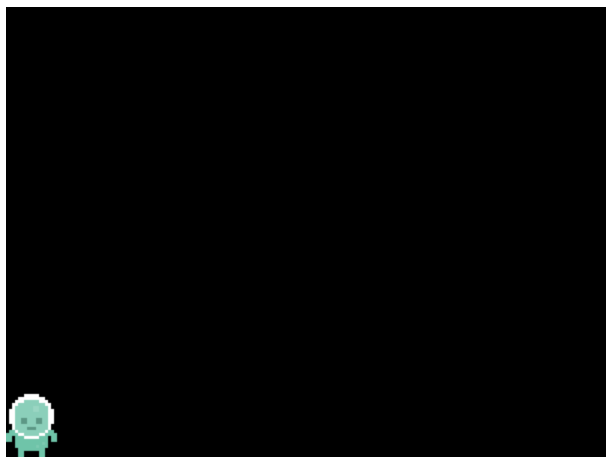

<a href="javascript:void(0)" class="closebtn" onclick="closeNav()">×</a>

#### GETTING STARTED

[Introduction](#introduction)

[Jumping Right In](#jumping-right-in)

[Choose your own Adventure](#choose-your-own-adventure)

#### CODING FROM SCRATCH

[Building a World](#building-a-world)

[Create a Game Space](#create-a-game-space)

[Adding Movement](#adding-movement)

[Adding a Reward](#adding-a-reward)

[Hazards and Enemies](#hazards-and-enemies)

[Understanding our Game Structure](#adding-game-states)

#### GAME MECHANICS

[Game Mechanic: Add Moving Enemies](#game-mechanic-add-moving-enemies)

[Game Mechanic: Jumping on Enemies](#game-mechanic-jumping-on-enemies)

[Game Mechanic: Add a Countdown
Timer](#game-mechanic-add-a-countdown-timer)

[Game Mechanic: Longer Jumps if Holding Jump
Down](#game-mechanic-longer-jumps-if-holding-jump-down)

[Game Mechanic: Smaller Sprite Collision
Boxes](#game-mechanic-smaller-sprite-collision-boxes)

[Game Mechanic: Extra Lives](#game-mechanic-extra-lives)

[Game Mechanic: Player Health](#game-mechanic-player-health)

#### ADDING POLISH

[Polish: Adding our Own Sound
Effects](#polish-adding-our-own-sound-effects)

[Polish: Add Animation to your
Character](#polish-add-animation-to-your-character)

[Polish: Add Soundtrack Music](#polish-add-soundtrack-music)

[Polish: Animate Sprite when Zapped](#polish-animate-sprite-when-zapped)

[Polish: Screen Shake](#polish-screen-shake)

[Polish: Explosions using Particles](#polish-explosions-using-particles)

#### GAME SPACE

[Game Space: Add your own Background](#polish-add-your-own-background)

[Game Space: Add Game Over Screen](#game-space-add-game-over-screen)

[Game Space: Extending the Game
Size](#game-mechanic-extending-the-game-size)

[Game Space: Scaling Sprites](#polish-scaling-our-game-and-sprites)

[Game Space: Adding Levels](#game-space-adding-levels)

[Game Space: Keys and Doors](#game-mechanic-keys-and-doors)

[Game Space: Create a Cut / Opening
Scene](#polish-create-a-cut-opening-scene)

[Game Space: Adding Levels with Json](#game-mechanic-adding-levels)

☰ Menu

# OPENING SCENE

# Introduction

Learning to code can be like a tricky puzzle to solve. At times you get
stuck. It helps to have a project you really want to get working. In
this book creating a Retro Platform Game is that project. Part one of
this book is a structured start covering the basics. Part two encourages
you to choose your own adventure, offering you a choice of many missions
with supporting working code examples. This lets you add new features,
complexity and style to make the starting game into your own designed
game experience.

We will make our games on the web in a code playground called
Glitch.com. This means that we can easily share our coding creations as
part of web pages. You can get your friends and family to play and test
the games you create.

### What this Book is and isn't

This book is:

> -   a great way to get started making a simple 2D arcade style game
> -   a fun way to find out about the basics of the coding process
> -   an introduction to Javascript and some of the ways it does things
> -   a partner guide to support more hands-on collaborative workshops

This book has limits! It's a short book that you can progress through
quickly. Here are some of the things that we don't cover;

> -   Advanced 3D approaches to game making or any role playing elements
> -   Systematic ways to learn a programming language (we pick up
>     concepts when we need them)
> -   Complete guide to the most advanced approaches to writing game
>     using the Phaser code library

How we learn is described in more detail in a [chapter in the
Appendix](https://glitch-game-club.github.io/3m/#how-we-learn-javascript-in-this-book/).
In a nutshell. We learn by diving into the process of making games by
tinkering with a simple (but slightly broken) grid game. Then you have
the choice of either following a short course which covers the bare
minimum of platform game or to keep tinkering/remix the grid game by
choosing from a list of options to alter and extend it.

### Playful group learning processes

This guide was offered originally as a support to group work. As such,
it contains group starter and reflection activities. These are included
at the end of this book in the appendices, so as not to interfere with
the flow of someone working through this book to teach themselves.

## Making Games on the Web using Glitch

This book uses Glitch our working and learning space for games. At
**Glitch.com** you have an editing area for your code on one tab of the
browser and a preview area on another tab. We can also see our code side
by side. This kind of website is called a **Code Playground**. Using
Code Playgrounds skips having to set your own website and importantly
they let you type in some web code and you can see a preview of the
resulting webpage immediately. This quick feedback is great for beginner
coders. We can see straight away when we have something right or when we
have made a mistake that need correcting.

  

## Making Games using Phaser

Phaser is a Javascript library which supports the creation of web games.
Real game developers made it and other game developers use it. It's also
a great choice to make retro games. Retro games have come back into
fashion. They are fun and easy to play on home computer, consoles and
especially on your phone. Parents play them with children and they are a
great way to start learning how to make digital games.

This book will help you create a game in a step by step way adding
different game features along the way. It is inspired by and guided by
some great tutorials that are out there on various websites.
Particularly the work of Richard Davey at Phaser, end3r, Belen Albeza
and Chris Mills at Mozilla and Thomas Palef at lessmilk.com.

### **Why Javascript for beginners?**

Javascript is great learn as it is the language of the web. But even
fans would admit that learning Javascript can be tricky and there are
lot so different ways to do the same thing. A lot of beginner text
coders and teachers stick to Python or other text code languages that
are easier than Javascript. You can also avoid text code completely if
you want to make games. Kodu, Scratch and Game Star Mechanic use a
visual approach to coding games, where you snap together colour coded
blocks. However, we think that the combination of tools like Phaser and
Glitch and a supportive community of learners bring the use of this
authentic language within grasp of beginners.

### About the Phaser Community and Games

Richard Davey is the lead coder on the Phaser project. There are two
main versions of Phaser in use. Phaser 2 and Phaser 3. This book looks
at Phaser 2, as it is easier to start to learn. One thing that the
community of people using Phaser to make games is very good at is
sharing how they do it and helping others who get stuck. There are some
fantastic resources available for free. A lot of these resources are
available on the main Phaser website.There is also an online forum for
when you get stuck as well here -
<http://www.html5gamedevs.com/forum/14-phaser-2/>

There are some great games out there made with Phaser which we can look
to for some inspiration. Here are a few of our favourites.

**Dork Squad:** Can you (and a partner) save the world from robots? Have
you got what it takes? <https://eoinmcg.itch.io/dork-squad>

**Grooow:** Platformer game with puzzle elements! Pick up all the dots
to advance to the next level. But be careful! The more you pick up, the
heavier and bigger you get, and thus it'll be more difficult to move and
jump! <https://ladybenko.itch.io/grooow>

**Cybertank:** Guide the tank through the levels to collect the cubes
and escape. Great sounds and retro graphics here.
<http://cybertank.paulp.ws/>

**Knife Hit:** This game is created as part of a fantastic tutorial.
It's a bit advanced for beginners but is definitely worth checking out.
<https://www.emanueleferonato.com/tag/knife-hit/>

  

# JUMPING RIGHT IN

# Jumping Right In

To get started, let's alter the graphics and game-play of a game that
has already been made. This will help us to see some of the code
involved before we have to start writing our own. This idea is to make
the whole process seem less scary, by making quick changes which we can
see the impact of. Like in a game, this quick feedback gives us a sense
of control.

## Getting started with the Glitch.com Codeplayground

We are just about to use Glitch to play and mess around with games. Here
are a few things to help you get started.  

-   You can hit the Fishes in the game playing window and choose **Remix
    on Glitch** to make a new copy of this game so you can make your own
    changes (only do this once!)  
-   The JS file with the game code should show by default but click on
    **game.js** in the list of files on the left if it doesn't
-   After making your changes, click on **Show Live** and your browser
    will open a new tab allowing you to play again with the updates
-   Keep the two tabs open and swap between the code view and your game
    view to make more updates
-   Once you have started working, if you lose your code page then you
    can click on the Fishes and select **View Source** to make more
    change

  

##  

  

## Have a play with a simple platform game

Play this game using the cursor keys to move -
<https://grid-game-template.glitch.me/>

You may notice that **the game is impossible**. It is. But the good news
is we can fix it. To do this hit the two fishes at the top right of the
screen and choose **Remix on Glitch.** Remixing means we create our own
version of the game that we can change. You now have the following
challenges which are available as a [printed document of cards
here.](https://docs.google.com/presentation/d/1fZYko5dL-r3RHF6NZsLyZspBE77K8XIfLgnZ2HFj58Q/edit#slide=id.p)

****

What follows is a list of the kinds of changes that are suggested on the
cards.

**Starting challenge - Change Gravity:** find the gravity variable and
to change the number so that you can complete the game. To do this
change the following line.

      var gravity = 500;

**Starting challenge - Change Background Colour:** You can Change the
background colour of the game.  

      game.stage.backgroundColor = "#5699ab";

**Starting challenge - Change Velocity Settings:** You may think the
game is a bit slow, changing velocity lets your character moves faster
to the left and the right and up when jumping. Play with the following
lines

      var velocity_x = 100;
      var velocity_y = 300;

**Next level challenge - Add more hazards and coins:** change the game
so that there are more hazards and coins, do this by altering the o's
and h's in the grid shown in the code example below

        // Design the level. x = platform, o = coin, h = hazard.
        var level1 = [
            "                 ",
            "                 ",
            "    o            ",
            "  h              ",
            "  xxxxx          ",

**Next level challenge** **- Make your own pixel art**: see the help
section below for how to use piskel and import those images into your
game.

**Next level challenge - change the platform layout:** change the
platform layout of the game to make it more challenging alter the x's in
the grid code show below

**Boss level challenge - Balance your game:** - Use all your knowledge
of velocity and gravity and the placement your platform, hazard and
coins to make a challenging game that is still possible to beat

## Create your own characters

We can use a online sprite / pixel art editor to add our own characters.
There are many tools you can use but let's use an online editor called
Piskel. You don't have to log in but it can be a good idea to do so you
can save your work. To get started point your browser to
<https://www.piskelapp.com/> and click on **Create Sprite.**

When you create your sprite, by default it creates one **32 pixels
high** and **32 pixels wide**. This is perfect for our game.

Piskel is a pretty intuitive tool to use so we're not going to give you
full instructions for how to make your character here. But here are a
few tips.

1.  In your tool bar on the left, you can select the different icons to
    draw and edit your images.
2.  You can change the size of your drawing tool by clicking on the
    different sized squares above the toolbar.
3.  You can change the colour of your drawing tool by clicking on the
    block of colour below the tool bar
4.  It is possible to create animated sprites by clicking on **Add new
    frame** or duplicating your existing frame

Let's start with a one frame static Sprite. When you are happy with the
single frame you have created we are going to export it. Click on the
**export icon** - a mountain - on the right.

We are going to export a PNG image to a bit of code called a data URI.
So click on the **PNG** tab and then select the **Open** option under
**Spritesheet data-uri export**.

A **Data URI** is a way of saving an image or other kind of data as a
long-ish stream of code. It looks kind of scary but we don't need to
understand it at all. We just need to know what to do with it. Now copy
the text that appears on the screen to your computers clip board using
**Control + C** on your keyboard or right clicking the mouse and
choosing **Copy**. This is our image as data.

We are now ready to go back to the game code to add our own character.
Look for the piece of code that says:

    game.load.image("player", "https://cdn.glitch.com/05027ea3-803e-2Fplayer.png");

Replace the code between the last set of quote marks. Make sure to keep
the "player" part there. Just replace that code that is highlighted in
the image below with the code you just copied. To do this you can use
**Control + V** on the keyboard or right click and choose **Paste**.  

Let's see what that looks like by clicking on **Show Live** to see our
gave. You should now see your character as the player in the game. If it
doesn't work then go back to your code and try the process again. It is
easy to make mistakes when copying and pasting like this. Part of our
job is to get used to making these kinds of mistakes and going back and
fixing them.

### Extra Activity

If you have more time then you can do the same process of making your
own pixel art for the following:

-   replace the yellow blocks coins with your own design of a reward, a
    coin, star or simlar
-   replace the red hazards block with an image that students have to
    avoid
-   replace the blue blocks with your own image of a platform  

## Debugging your code in Glitch.com 

So that's it. We have done our first bit of Javascript coding. Ok, we
didn't write the game from scratch. But a lot of coding is about
adapting what someone else had done before. A lot of the code we are
going to meet can be quite readable. Take the following code.

    game.load.image("player", "http://digitalducks.org/images/ggc/player.png");

Some of the language is very similar to real English this. Here this
line **loads** an **image** into the **game** and gives it the name
**player**. At the same time, somethings look quite intimidating. There
are "double quotes", normal brackets (), curly brackets{}. These do all
do slightly different things. Don't worry, we'll pick them up as we go
along by looking at and writing our code.

**The Glitch website can help us** if we do make a mistake and the code
stops working. Imagine you paste in some code from Piskel, it is easy to
delete some code at the end - say the ***");*** -. You end up with the
following

    game.load.image("player", "data:image/png;base64,iVBORw0KGgoAAAANSUhEUgAAAB4AAAAeCAYAAAA
         EUgAAAB4AAAAeCAYAAAA7MK6iAAAAKUlEQVRIie3NoQEAAAgD

This is not going to work and will give us an error, hopefully one that
we we can use to help us work out where the problem is. In this case it
does give an error as shown by the **red dot**.

Hover over this red dot to see the full error.

In this case, there is a similar line of code following it. So to
correct our code we can see how it is different from that line and see
that we need to type the missing ending code of ***");*** If we add that
back in then we can say we have fixed a **bug**. Debugging is finding
and solving errors in our code.

If we have other mistakes we could try some of the following:

-   reading the error message to see if it tells us what kind or error
    it is
-   looking at the relevant line of code and comparing it to other
    similar ones in our program (is there anything different/ missing
    here)
-   if that doesn't work try going back to the original project that you
    remixed from, view the source it again to see the working code and
    then comparing that working code your broken code
-   If you are still stuck then you can click on the &lt;&lt; icon on
    the bottom left of your project to rewind the work you have one by
    minutes or even days.  
    

      
      

# Choose your own Adventure

There are different ways you can use this book to learn to make your own
games. Normally books encourage you to start at the beginning and keep
reading until you get to the end but this book isn't (just) like that.
The reason is that different people learn how to code and make games in
different ways. Also different people have different inspirations that
keep them interested and motivated.

This is also true of the way that people play games. There's a well
known model of different play style types by Richard Bartle. This model,
which was based on observing and analyzing the behaviors people playing
together in a multi-user game, holds that there are four different kinds
of play style interests, each of which is given a descriptive name:
Griefers, Achievers, Explorers, and
Socializers.[1](#endnote-f857f158-b619-48cb-b0dd-b7c74c54dd3d)

-   **Griefers**: interfere with the functioning of the game world or
    the play experience of other players
-   **Achievers**: accumulate status tokens by beating the rules-based
    challenges of the game world
-   **Explorers**: discover the systems governing the operation of the
    game world
-   **Socializers**: form relationships with other players by telling
    stories within the game world

Different kinds of games suit different play styles. One of the notable
successes of recent years have been open world games that allow you to
choose how you play the game. If you want to stick to the main missions
you can follow guidance to do that but if you just want to explore or be
social or mess around you have the chance to to do that too.

In the same way there are different styles of making games. I'm
proposing the following;

-   **Social makers:** form relationships with other game makers and
    players by finding out more about their work and telling stories in
    their game
-   **Planners:** like to study to get a full knowledge of the tools and
    what is possible before they build up their game step-by-step
-   **Magpie makers:** like trying out lots of different things and
    happy to borrow code, images and sound from anywhere for quick
    results
-   **Glitchers:** mess around with the code trying to see if they can
    break it interesting ways and cause a bit of havoc

### **Open World vs On Rails Learning**

A lot of learning and guides suit the **planners** of this world. They
start with a blank canvas and allows you build up your game step by step
explaining just about every line of code that you add. This book does
just that in the following handful of chapters, they take a structured
approach to getting to a minimal platform game and give details of
coding concepts (objects, functions, variables, loops and conditionals)
in a logical order using concrete examples from our emerging game. This
approach is called building up code "From Scratch".

**This book aims to support learners who like a more "Open World"
approach to learning.** To do this the later sections of this book take
a different approach to helping you make games. You are encouraged to
various different game features in what ever order you like. The
chapters are much shorter and designed to be self-contained. Almost like
little side or social missions that you get in great open world games.
If you like experimenting you can skip the next set of chapters and user
the starting [Grid Game
Template](https://glitch.com/~grid-game-template)[2](#endnote-6c3ee05e-62b5-4299-bb7b-8a69431ded0e)
as your jumping off point. You can Remix this game to add in new
features and looks right away. If you have been following this book you
would have done that in the first chapter.  

But to help get an overview of what's there let's look in a bit more
depth about what makes a good game.

## What makes up a Game?

We play them all the time but did you ever ask - What exactly is a game?
How is it different from just playing around? The Institute of play list
key components that make up a game, be it video or non-digital game.
They are as follows.

-   **Goal:** The overall goal of the game, what do you have to do to
    win
-   **Parts:** What parts make up the mechanisms of playing, this could
    be physical, like dice or cards, or digital like our enemies, player
    and other hazards
-   **Rules:** Relationships that define what a player can and cannot do
    in the game. If...then...or you may...you may not... are good
    sentence starters for rule making
-   **Challenge:** Obstacles might you put in the player’s way to make
    reaching the goal fun and interesting
-   ****Space:**** Where the game take place and how that space affects
    the game
-   **Mechanics:** The core actions or moves does the player has to do
    to power the play of the game

The Institute of Play encourage you to think about these different
elements of a game to allow you to start to make your own game or to
start **modding** or remxing an existing game. Modding is modifying a
game that already exists.

### Our own Framework for Game Elements

The above framework is great for a deep analysis of how the different
parts of your game interact. Frameworks can be great to help us map our
journeys. To help us do that we have a simplified framework which has
evolved looking at the different requests that our learners make to add
different elements to games.

  

This framework consists of Core Parts, Game Mechanics, Game Space and
Game Polish. **Core parts** of our game are similar, this involves the
individual elements of the game and their attributes, we may add more
enemies for example. **Game Mechanics** in our definitions is about what
you do in the game. Where game parts are nouns and mechanics are verbs.
So for our platform core mechanics would be jumping and collecting.
However some of our mechanics are a bit more like more like extra
challenges or rules, like adding a timer. So this is a fairly wide
definition of game mechanic in line with [broader definition from
Sicart](http://gamestudies.org/0802/articles/sicart)[3](#endnote-1554888824262).
**Game Space** includes the design or new levels and anything that opens
up space like keys and doors or scrolling screens.  

**Game Polish** or game aesthetics is a dimension identified as one of
the [four pillars of game
design](http://www.gamification.co/2013/09/24/adapt-gamification-designs-with-jesse-schells-four-pillars/)
by game theorist Jesse Schell
[4](#endnote-8972e733-a237-4157-9ae4-d1e2dc511c36). He makes
a distinction between the mechanics of the game, system elements that
effect the core functioning of how the players interact with the game
and that of the game aesthetics. Aesthetics here are the wrapping of the
game, not core to how it works but which have an effect of the game on
the emotions and state of mind of the player. For example the flavour of
the graphics and the sound design.

## Adding / Changing Game Mechanics

What game mechanics can we add to our platform game? You can choose from
some of the following.

-   **[Adding Moving Enemies:](#game-mechanic-add-moving-enemies)** make
    it harder for your players to get past your enemies  
-   **[Jumping on Enemies](#game-mechanic-jumping-on-enemies):** to make
    them disappear, a mechanic made famous by Mario  
-   **[Variable Jumping
    Heights:](#game-mechanic-longer-jumps-if-holding-jump-down)** if you
    press down longer you jump higher
-   **[Smaller Collision
    Boxes](#game-mechanic-smaller-sprite-collision-boxes):** If your
    game is too hard, you can set smaller hit boxes, lots of platform
    games do this
-   [**Add a Countdown timer:**](#game-mechanic-add-a-countdown-timer)
    this can increase the challenge of your levels, players must
    complete them before time runs out
-   **[Extra Lives:](#game-mechanic-extra-lives)** if you touch a hazard
    you lose a life and have to restart with one less life (to come)
-   **[Adding Player Health](#game-mechanic-player-health):** if you
    touch a hazard you lose health instead of losing a life

## Adding Game Polish

Elements of Polish are often not core to how the game works as a system
but the are key to how our player reacts to our game. The following
changes can help.

  

-   **[Add your own Sound
    Effects:](#polish-adding-our-own-sound-effects)** swapping out
    existing sounds and adding new ones for example when you jump  
-   **[Add Animation to your
    character:](#polish-add-animation-to-your-character)** make them
    look like they are running or jumping
-   **[Add Soundtrack Music](#polish-add-soundtrack-music)**: have some
    music on a loop when game play is happening
-   **[Animate Character when
    Zapped:](#polish-animate-sprite-when-zapped)** here an animation is
    played when a player or character gets zapped  
-   **[Screen Shake:](#polish-screen-shake)** mimicking a shaking screen
    to create a dramatic ending
-   **[Explosion on Dying:](#polish-explosions-using-particles)** use
    particles to mimic an explosion when a character dies

## Changing Game Space

Here are some things you can change around the way you game uses space
or give the player the feeling of exploring space.

-   **[Add your own Background:](#polish-add-your-own-background)** you
    can create your own pixel art or drawn background to add to the
    game  
-   [**Add Game Over Screen:**](#game-space-add-game-over-screen) let
    your player know when they have failed!  
-   [**Scaling our Game and
    Sprites**](#polish-scaling-our-game-and-sprites): this may be for
    aesthetic effect or could affect game mechanics too  
-   **[Adding Levels:](#game-space-adding-levels)** This can increase
    the challenge of our game greatly  
-   **[Extending the Game
    Size:](#game-mechanic-extending-the-game-size)** if you want your
    game to scroll as your player moves, this is how!  
-   **[Keys and Doors](#game-mechanic-keys-and-doors)**: collect keys to
    open previously closed doors can add as sense of adventure to your
    platformer  
-   [**Create a Cut / Opening
    Scene:**](#polish-create-a-cut-opening-scene) A great way to
    introduce rules, info about your game or a story  
-   [**Adding Levels with Json**](#game-mechanic-adding-levels): a
    neater way to create your levels and a way to find out more about
    data structures.

## Go On Choose your own Adventure

So go on and choose how you want to progress. As described you can start
from scratch and build up your code bit by by bit so you really
understand how each part works. You can do this by following the next
chapters starting with [Building a World](#building-a-world).

Alternatively, if you like to just jump in, you can keep changing the
[Grid Game code](https://glitch.com/~grid-game-template), adding in
graphics and tinkering around by adding things from the examples just
listed above. [This page on Glitch also lists the code
examples.[5](#endnote-1555586500542)](http://ggc-examples.glitch.me/)  

### Meeting yourself in the middle

Another way to do this is to try both approaches at the same time. In
this way you get all of the fun of adding in new exciting game elements
to a working game but can back this up by following a logical structure
as well. To help you make a connection between the From Scratch approach
and the tinkering with the Grid Game approach you can dive into the
chapter called [Understanding our Game
Structure](/web/20210301145712/https://en.flossmanuals.net/phaser-game-making-in-glitch/adding-game-states/).
If may want to read that when altering the Grid Game if you get confused
when making larger changes.  

  

1.  https://www.gamasutra.com/view/feature/134842/personality\_and\_play\_styles\_a\_.php
2.  https://grid-game-template.glitch.me/
3.  http://gamestudies.org/0802/articles/sicart
4.  Here's the
    book https://www.oreilly.com/library/view/the-art-of/9781466598645/
    and here's a summary
    http://www.gamification.co/2013/09/24/adapt-gamification-designs-with-jesse-schells-four-pillars/
5.  http://ggc-examples.glitch.me/

# CORE GAME PARTS

# Building a World

Let's get started by creating a game world and adding a player to it.
Many web developers use a c**Code pPlayground** to quickly and easily share a
working version of their code as a webpage, or part of a page.
Using a cCode pPlaygrounds is much easier then needing your own
webspace. In some ways, all code playgrounds are similar. These tools
let you type in code, and display a preview of the resulting webpage
immediately. This quick feedback is great for beginner coders. We can
immediately see when we have written something properly, and when we
have made a mistake that needs correcting. In this book, we are using
glitch.com as our code playground.  

## Creating a Game Area

Our first job is to create a gGame aArea on a web page. To create a game area, we should
decide how big it should be on the screen, as well as its and also what shape it is.

For our project, we will be harkening back to a golden age of video
consoles: the 8-bit of Nintendo and Sega home video consoles. **Game
sizes are normally measured in pixels (px);** Pixels are the size of the
smallest dot on the screen. Because Mario is such a well known game
character, we will use him as an example to get a sense of our game
scale. Early Mario Bros. games had a screen size of **256 px wide by 224
px high** (256 x 224). Let's increase the game size to **400 x 300
pixels,** to give us a bit more room to play. Now that we know our game
size, we need to create a game space using code.  

One of the great things about using a code playground is the ability to
**Remix** the work of others and use existing code as a template
starting point. Lets give it a try. Our game will be made up of
Javascript, living within an HTML page that will link to the Phaser
library and our own Javascript game code.

To begin:

1\. Go to
<https://glitch.com/edit/#!/baw-chapter-starting-frame?path=game.js>

2\. Click on the fish in the top right

3\. Click **Remix on Glitch.** At this point you should probably also
click Sign In and create an account to save your work.

4\. Add the following code into the game.js file under the line that
says ***//start your code here***

      var game = new Phaser.Game(400, 300);

5\. Click **Show Live.** You should see a new browser tab open and now
see a black area appear on the top left of the screen.

This may not seem like much but it's a great step forward. It means that
the phaser library is up and running in your page and has created a game
space ready for us to fill with interesting things.

We are now going to create a bit of code called an object that will give
us a structure for a lot of our most important game elements. Write the
following code in game.js underneath the line your have already written
.

      var playState = {};

      var playState.preload = function() {
      };
      var playState.create = function() {
      };
      var playState.update = function() {
      };

      game.state.add("play", playState);
      game.state.start("play");

Let's explain that code a bit. The first line creates an object for the
main part of our game where we play the game. This is called the
**playState** object. It's the only game state object we need to worry
about now but we can add a game over state and welcome state later if we
want to.

The three statements after it add three functions to this object. The
functions here form a useful structure for our code allowing us to
organise it. The structure is based around when each part of the code
needs to run. The sections run in the following order;

-   **preload:** add code here to preload images and other assets for
    the game
-   **create**: this code runs after preload and is where we add images
    and other elements to the game
-   **update:** this sections runs over and over again for as long as
    the game is playing

The last two lines add this code (a state object) to the game and say
that this is the first bit of code to run when the game starts. We will
explore this more later as we start to add more complicated code. For
now we can type it and forget about it for a bit.

## Adding a Player to the Game Area

We can add a player in a similar way. However as we are going to do more
with our player we need to change how we add them a bit. Add *var
player*; above the line where you create the **playState** object e.g.  

      var player;
      var playState = {};  

Putting this line where we *declare* the player variable outside of the
playState object means that all the different functions (like preload(),
create() and update() will be able to work with it. This will be useful
later.

Add the following code to the **preload function  
**

      game.load.image("player", "https://cdn.glitch.com/5d318c12-590d-47a1-b471-92a5dc0aae9d%2Fhero_stopped.png");

And the following to the **create function  
**

      player = game.add.sprite(0, 0, 'player');

Your screen should now show a player added at the top left corner. The
top left of the player is added at co-ordinates **x:0 and y:0**

## Adding Gravity to our player

At the moment our Player is stuck at the top of our game. Normally in a
platform game gravity acts to pull down our player towards the floor. We
can add gravity to the player to make this happen. Gravity is one of the
game elements that are dealt with by the Physics system. To add physics
abilities to all the game world elements add the following lines right
at the start of the **create function** code.

      game.physics.startSystem(Phaser.Physics.ARCADE);
      game.world.enableBody = true;

Then add the following line of code in create after where you add player
to the game.

      player.body.gravity.y = 500; 

Your player should now fall from the top of the screen when you run your
code. Gravity works! But the player falls all the way off the screen so
it is no longer visible. This is not idea for out game. Later will add
platforms but for now we will just stop the player from leaving the
screen. We do this using the collideWorldBounds capability. Add the
following line after your last one in **create function**.

      player.body.collideWorldBounds = true;

The player should now stop when it falls to the bottom of the screen. If
this all seems a bit basic to you **Don't Worry** we are actually going
great guns here! We've already got past some of the biggest barriers to
getting started making a web game.

## Check your Code

If you have followed this chapter correctly should should have some code
like the following area -
<https://glitch.com/edit/#!/building-a-world-chapter?path=game.js>

### Understanding Sequencing

One of the key concepts in computer programming is the importance of the
sequence of the computer commands that you write and how they are run.
In each of our functions the computer - or code compiler more
correctly - will read our code from the first line of the function to
the last. This means that it is important to make sure our code is in a
logical order. There is a good beginner resources on sequencing here -
<https://www.bbc.com/bitesize/guides/zsf8d2p/revision/1>

To give an example we can look at the lines of code which add

      player = game.add.sprite(0, 0, 'player');
      player.body.gravity.y = 500; 

We can see here that first the player is added to the world and second
the gravity value for that player is set. What happens if we swap over
the order of these two lines? Try it out put the line with gravity above
the line that adds player to the game. Then click on your **Show Live**
tab.

Because the line setting the gravity property is before the line where
the player is created it means that there is an error. The screen
appears but our player doesn't load. The message here is that we need to
have some awareness of what order we should be running different parts
of our code and to pay attention to the sequence, the order that we put
it in.  

### Variables and the var keyword

When coding we often create variables using the *var* keyword. A
Variable means something we can create and change. Variables can be used
to hold different kinds of information, numbers, words, true/false
elements, and more complicated groups of elements called objects. In our
code we create several variables **player and gravity are key ones.  
**

To start using a variable we need to declare it using the **var**
keyword. You can see that happens with player right at the start of the
code. After that we can just use player to refer to the variable, we
only use var when making it (declaring it). You may ask why do we list
some variables at the start of the code or relevant functions. This
helps make our code simple to read and understand.  

### Using functions and parameters 

We have already written some functions in code. For the **playState**
object we have written and added three functions to it; **preload**,
**create** and **update**. We create and use these functions to help us
to organise our code as they run in a particular order. The Phaser
framework calls and runs the code in these functions one after the other
as the web page loads.

As well as creating our own functions, we will also meet other functions
which area already written for us that we can use. These **functions**
are also sometimes called ***method*s**. To make things simpler in this
book we will try to use only the term **function**.  

Phaser contains pre-written functions which are bits of code that do
certain jobs for us. We can recognise them by the use of brackets
***()*** after the name of the function being called. For example. here
look at the following code.

        game.add.sprite(0, 0, "background");

Here we use a function of game called ***game.add.sprite()*** to create
and add our new variable called player to the game object. Between the
brackets we including three pieces of information called **parameters**.
In other words in this line of code **we pass this function three
parameters**.  

The parameters passed to the function here are; the x co-ordinate 0, the
y co-ordinate 0, and the name of the image to add 'background'. This
particular function needs these bits of information to be able to do its
job of adding the image passed to it at the right place in the game.
We'll get used to passing **parameters** into **functions** as we go
along. For now just try to be aware of these terms and try to understand
how they are being used when you come across them.

 

# Create a Game Space

Let's add some elements to make a
more realistic game space. We use the platform game genre as that is
easy to recognise and to create code for. Let's create some platforms
for our player to jump onto and some coins to collect.

## Creating a Group for our Platforms and Ground

We already know how to add images to our game but when we add our
platforms we are going to do it in a way that allows us to change the
properties of all the platforms at once. You will see how this will be
useful in a bit. To do this we will first create a group, and then when
we create each platform we will add them to that group. To add specific
platforms we now need to follow this pattern.

-   load images in preload
-   add images in create
-   add them to the platforms group
-   add code to make the player stand on the platform

First let's add the variable platforms to the start of our code. Change
the code.

      var player;

so that it now reads

      var player;
      var platforms;

In the **playState.preload** function let's load up an image for ground
and a platform.

      game.load.image("ground", "https://cdn.glitch.com/5d318c12-590d-47a1-b471-92a5dc0aae9d%2Fground.png");
      game.load.image("grass:4x1", "https://cdn.glitch.com/5d318c12-590d-47a1-b471-92a5dc0aae9d%2Fgrass_4x1.png");

At the end of our the existing code in the **plaSstate.create function**
let's add the code which creates a group in our game called platforms
and enables body so that it can interact with other elements in the
game.

      platforms = game.add.group();
      platforms.enableBody = true;

Now let's add this code after the above to create a ground for our
player to stand on

      var ground = platforms.create(0, 275, 'ground');

Try running your code at this point. You will see that when the player
sinks down behind the floor. To avoid this in **playState.update:** add
this code

      game.physics.arcade.collide(player, platforms);

Try again and this time the player bumps the platform down out of sight.
To avoid this add another line after your last one added to
**playState.create:**.

      ground = platforms.create(0, 275, 'ground');
      ground.body.immovable = true;

Follow this pattern to add more platforms for the player to jump on**.**

      var platform1 = platforms.create(150, 220, 'grass:4x1');
      platform1.body.immovable = true;

      var platform2 = platforms.create(250, 150, 'grass:4x1');
      platform2.body.immovable = true;

      var platform3 = platforms.create(75, 100, 'grass:4x1');
      platform3.body.immovable = true;

Feel free to change the location of your three platforms to make them
more challenging.

## Debugging Jumping

This game actually starts with a Glitch at this point that we have to
fix. There is something not right about jumping here. We can jump when
ever we want. This means we can jump right up to the top of the screen
as if we were flying. This isn't what we want. We should only be able to
jump when we are touching the ground. This will be is one the rules of
our game and it is common to a lot of platform games. To make this
happen we can use a conditional statement using **if**.

Change the code which controls the up keyboard key to change the
statement condition in the first line to be:

      if (game.input.keyboard.isDown(Phaser.Keyboard.UP) === true && player.body.touching.down === true) {
        player.body.velocity.y = -300;
      }

This if statement now has has two conditions that need to be true before
the code in brackets will run. The user must be pressing the UP key and
the player character must be touching down on one of the platforms. If
they are already jumping they will be in the air, and the
player.body.touching.down property will be false and the code in the
conditional block won't run.

## Checking our Code

Have a look at the following Code area to check your code against what
we think you should have.
<https://glitch.com/edit/#!/create-game-space-chapter?path=game.js>

### More on conditionals

As we can see in the code controlling jumping, there can be more
conditions that needs to be true or false before a certain piece of code
can run. In the last chapter we saw how the three options of **if, if
else** and **else** provide a flexible way of providing different
options of code to run depending on different user input and other
conditions. Now let's look at the **(condition)** part of the statement.

The process for this is known as True / False or Boolean Logic and even
though we are dealing only with different options which are all true or
false it can quickly get confusing. Let's take a simple example where
were are testing if something is true. We can use the === comparison
operator to check this in our conditional testing statement. Let's say
we are testing to see if it is raining.

      if (isRaining === true){
        wearCoat();
      }

But imagine a situation where we want to check if it is raining **OR**
if the clouds are dark. If **either** is true then take a coat out. This
could be checked using the **||** logical operator - which means
**OR** - to check both conditions.

      if (isRaining === true || isDark === true){
        wearCoat();
      }

However, if we want to check if it raining **AND** the clouds are dark
and we will only then take a coat out if **both** are true. This might
be structured like this.

      if (isRaining === true && isDark === true){
        wearCoat();
      }

Let's look at a table from the above resource of the logical operators
used here to help understand them.

<table data-border="1">
<tbody>
<tr class="header">
<th><strong>Operator</strong></th>
<th>Description</th>
<th>Example</th>
</tr>
<tr class="odd">
<th>&amp;&amp;</th>
<th>and</th>
<th>(x &lt; 10 &amp;&amp; y &gt; 1) is true</th>
</tr>
<tr class="header">
<th>||</th>
<th>or</th>
<th>(x === 5 || y === 5) is false</th>
</tr>
<tr class="odd">
<th>!</th>
<th>not</th>
<th>!(x === y) is true</th>
</tr>

</tbody>
</table>

This is a subject that suits learning through doing, through
experimenting and getting things a bit wrong and trying out different
options until you get the one you want. As mentioned previously, there
is a resource which is more complete here.
<https://www.w3schools.com/js/js_comparisons.asp>

 

# Adding Movement

We are going to jump right into making our game move. You will need to
have followed chapter on **Building a World** and have that code ready
to follow these stages. If not, see here for the relevant code (you can
click on the Fish image and then Remix on Glitch to pick up from here)
<https://glitch.com/edit/#!/building-a-world-chapter?path=game.js>

## Moving our player around the screen

Now we have a player appear, fall to the bottom of the screen and they
should now be standing at the bottom of the game area.

Before we start adding platforms or other characters, let's get our
player to move around the screen using the cursor keys on the keyboard.
To move our player we need to start to work with what we call **player
input**, this is how the player of the game interacts with what is
happening, in this case we want the person playing the game player to be
able to control our game player character using the arrow keys on the
keyboard.

Let's start with moving left and right. Let's add the following code to
our **update function**.

        if (game.input.keyboard.isDown(Phaser.Keyboard.LEFT) === true){
          player.body.velocity.x = -200;
        }
        else if (game.input.keyboard.isDown(Phaser.Keyboard.RIGHT) === true) {
          player.body.velocity.x = 200;
        }

This seems to work up to a point. Changing the **velocity.x** property
to 200 or -200 when the left or right key is pressed does create
movement. However the player just keeps moving even if we are not
pressing down a key. To avoid this happening we can add one more
condition to our **update** function.

        if (game.input.keyboard.isDown(Phaser.Keyboard.LEFT) === true){
            player.body.velocity.x = -200;
        }
        else if (game.input.keyboard.isDown(Phaser.Keyboard.RIGHT) === true){
            player.body.velocity.x = 200;
        }
        else {
            player.body.velocity.x = 0;
        }

This resets the velocity to zero and so stops any left right movement.
Putting this at the start of the update area means that if no key is
being pressed, then this is the default behaviour. To make our player
jump we can add another couple of lines of code.

        if (game.input.keyboard.isDown(Phaser.Keyboard.UP)) {
          player.body.velocity.y = -200;
        }

Now our player can go left and right and jump. This is starting to look
like a real game. You may notice that we can jump even though we are not
touching the ground. We will solve this issue later.

## Make it easy to control our speed

The velocity variables control how quickly the player moves. When we
create our game we think it is a good idea to put variables that easily
change the way our game works right at the top so it is easy to change
them. We did this with gravity last time. Lets change our code around to
do this. This process of improving code that does work but could be
better is called refactoring.

In the code above our velocity.x and velocity.y is set in the body of
the code. Let's create variables called velocity\_x and velocity\_y
right at the start of our code in our global game variables area.

    var velocity_x = 200;
    var velocity_y = 300;

Now we can swap out the direct mentions of those numbers from the code
in update change the lines as follows. For the x (left and right) value
do;

        if (game.input.keyboard.isDown(Phaser.Keyboard.LEFT) === true) {
            player.body.velocity.x = -velocity_x;
        }
        else if (game.input.keyboard.isDown(Phaser.Keyboard.RIGHT) === true){
            player.body.velocity.x = velocity_x;
        }

For the y (up and down) value

        if (game.input.keyboard.isDown(Phaser.Keyboard.UP) === true) {
            player.body.velocity.y = -velocity_y;
        }

## Checking our Code

You can check what you have in your code with the the completed code for
this chapter here -
<https://glitch.com/edit/#!/adding-movement-chapter?path=game.js>

### Understanding ****if statements / Conditionals: ****

One of the key elements of games are Rules. If this happens then do
that. Let's have a look at first bit the code used to control our
player.

        if (game.input.keyboard.isDown(Phaser.Keyboard.LEFT) === true) {
            player.body.velocity.x = -velocity_x;
        } else if (game.input.keyboard.isDown(Phaser.Keyboard.RIGHT) === true) {
            player.body.velocity.x = velocity_x;
        }

Statements here start with **if, else if** or **else**. These are also
called conditional statements. The format of the first part of a
conditional (also called **if - else**) statement can be expressed
conversationally as "**if** this condition is true, **then** do this
action". This can be represented in code pattern as

    if (condition) {
        action
    }

You can see that our code is testing for three statements. This format
allows us to programme a series of possible outcomes into our game. The
format here is like a list of options which the programme runs. It is
important to note that only one of the **if, else if, else** can run at
any one time. You should also know that there can be as many of the
**else if** options as you want.

There is more to explain how the **(condition)** part of this process
works in the next chapter. If you want to follow this up to learn more
about this aspect of coding then you can use some of the many online
resources that teach javascript. For example, there is more on
conditionals here - <https://www.w3schools.com/js/js_if_else.asp>

# Adding a Reward

In the last chapter, we talked about not having a real goal for our
game. In this chapter, we put in place a reward, a goal for us to chase.
In this case, it will be to collect coins.

## Creating our Coin

We already know how to add images as sprites to our world. We did that
with the player. Now we need to do the same a coin.

In the **preload** function add the following code

      game.load.image("coin", "https://cdn.glitch.com/07341419-e9df-484f-820f-d6799646cfcd%2F22coin.png");

Before adding any coins to the game. **We are going to create a group**
for all of our coins called, ***coins***, this will be useful when we
program the part of the game where the player takes the coin. Generally
we might want to create groups of objects when we want the same kind of
thing to happen to all the members in the group. In this case each time
our player touches a coin we will want that coin to disappear.

Add the following code in the **create** function in our code after
where we add the platforms.

      coins = game.add.group();
      coins.enableBody = true;

Instead of adding all of our coins one at a time, which we can see would
be quite repetitive, we can use a loop to do the job for us. Let's add 3
coins to the screen, spaced every 100 pixels. We will add them at the
top, but then add gravity so that they fall down until they touch a
platform. To do this add the following lines after the code above.

      for (var i = 1; i < 4; i += 1) {
        var coin = coins.create(i * 100, 0, "coin");
        coin.body.gravity.y = 200;
      }

## Making the coins disappear

At the moment we have something for our player to head for but when they
get there, they just overlap with the coins rather than it seeming like
the player takes them. Our next stage is to make them disappear. To do
this we rely on another bit of Phaser physics which is especially for
cases like this. Add the following code at the top of your **update**
function.

    game.physics.arcade.overlap(player, coins, takeCoins);

This line will be explained at the end of this chapter but what it means
is that when player and any member of the coins group overlap then run a
function called takeCoins (which we still have to write yet). Now let's
write the code that runs when that overlap happens. Add this after the
**update:** code has ended.

    var takeCoins = function (player, coin) {
        coin.kill();
    };

## Checking our Code

You can check what you have in your code with the the completed code for
this chapter here -
<https://glitch.com/edit/#!/add-a-reward-chapter?path=game.js:1:0>

## Loops and Iterating

When find ourselves doing the same thing over and over again when
coding, there is normally a better way to do this. At times in this
guide we do things the longer way in order to make the code easier to
read but here we use a loop when creating our coins. There are a few
ways to do this but one of the more flexible ways is to create a **For
Loop** which takes three statements. Here is a summary of some more
detailed information on how to use a for loop here -
<https://www.w3schools.com/js/js_loop_for.asp>

There are three key parts of For Loop, a starting point, a way of
knowing when to end the loop, and a way of changing the loop. Let's look
at a simplified example of how this is used in our code.

      for (var i = 1; i < 4; i++)
      {
        coin = coins.create(i * 100, 0, 'coin');
      }

You can see the following pattern.

      for (statement 1; statement 2; statement 3)
      {
        code block to be executed (normally more than once
      }

Very often a for loop will follow the following convention:

-   Statement 1 creates a variable often called **i** for iterator, (to
    iterate means to do things more than once).
-   Statement 2 sets up when the loop will end using some maths, in this
    case it will end when **i** is no longer less than 4.
-   Statement 3 runs after every loop and in this case increases the
    value of **i** by one each time.

Each time the loop happens, the result will be different as **i**
increases in value in each loop. If **i** starts off at 1 and increases
by one each time the loop runs until **i** is no longer less than 4, it
will run three times. Let's chart out how it will be different.

     coin = coins.create(i * 100, 0, 'coin');

The code above becomes:

1.  Loop One: i = 1 : coin = coins.create(1 \* 100, 0, 'coin'); - so
    coin created at 100,0
2.  Loop Two: i = 2 : coin = coins.create(2 \* 100, 0, 'coin'); - so
    coin created at 200,0
3.  Loop Three: i = 3 : coin = coins.create(3 \* 100, 0, 'coin'); - so
    coin created at 300,0

## Making and calling functions

We added our own function to the playState object called takeCoins when
the player overlapped with any coins. This is about the most complicated
bit of coding we need to do to make our first game so let's take some
time to explain what is happening.

When creating our overlap statement with the following line.  

    game.physics.arcade.overlap(player, coins, takeCoins);

If we are new to code then there is quite a lot going on here.
**Overlap()** is a function with several possible parameters. Here we
are using just three. These different parameters can be likened do
different holes in a block toy.

Let's look at the specification of the overlap function.

        overlap(object1, object2, overlapCallback)

1.  **object1:** The first object or group of objects to check
2.  **object2:** The first object or group of objects to check
3.  **overlapCallback:** An callback function that is called if the
    objects overlap.   
      

We pass in two objects or groups, in this case the player and the the
group of coins. We also want something to happen when there is an
overlap between the player and any of the coins. This is where the
overlap callback parameter comes in. We don't need to know a lot about
what a callback function is here. But in a nutshell here is a code that
will run if there is an overlap between the player and a coin. In our
case it makes it disappear with the coin.kill() code.  

# Hazards and Enemies

We need things for our player to avoid to add some challenge to the
game. In this chapter will we learn how to create static hazards and
moving enemies. Because they are both official hazards that zap our
player we will put them both in a group called hazards.

## **Adding an Animated Hazard**

Let's add a hazard into our game a location and let's make it move. We
will add a very simple flickering flame. It consists of two frames of
animation. They alternate give the flickering effect. Here is an image
of both frames, one besides the other.

To create an image like this you can use a tool like Piskel which we
used in the first chapter [Jumping Right In](#jumping-right-in).  

To make our image animated, we will add it as a ***spritesheet***, and
specify the width and height the frames, here 11 pixels wide and 27
high. And after that we can also load in a sound to play when we hit a
hazard. Put this code in **preload:**

      game.load.spritesheet("hazard", "https://cdn.glitch.com/5d318c12-590d-47a1-b471-92a5dc0aae9d%2Ffire2.png", 11, 27);

Then add the hazard to the game. Again as with the coins in the previous
chapter, we will create a group called ***hazards*** in case we want to
add more later. Add the following code to **create:**

      hazards = game.add.group();
      hazards.enableBody = true;
      hazard1 = hazards.create(100, 250, 'hazard');
      hazard1.animations.add('flicker', [0, 1], 6, true);
      hazard1.animations.play('flicker');

The next stage is to make the player disappear when they touch this
flickering flame hazard. This is done in a similar way to working with
the coins but in reverse. Add the following line to **update** part of
the code.

      game.physics.arcade.overlap(player, hazards, hitHazard);

We now need a hitHazard function to disappear our player if they hit a
hazard. Take care to follow the same pattern and to add this after the
takeCoins function.

      var hitHazard = function(player,hazard) {
        player.kill();
      };

This does give us win and lose conditions, so hey presto, we have a
game. But either of those options mean we are stuck in a form of limbo,
either alive with nothing to do, or you disappear leaving only the game
world. You will have to refresh the page to progress. Clearly this is
not ideal and we'll deal with that in the next section.

## **Restarting our Game**

We need something to happen when we hit a hazard / enemy or collect all
the coins. To make things simple let's just restart the game. To restart
our game when we die we're going to add a new function called restart()
to our code.

      var restart = function () {
        game.state.start("play");
      };

This restarts the currently running game state (we talk more about this
later) called 'play'.  
We now add a line of code to restart the game to our **hitHazard()**
function. It should now read as follows.

      var hitHazard = function () {
        player.kill();
        restart();
      };

We now need to restart the game when we have collected all the coins.
This is a little more complicated and involves creating a new function
that goes through. To do this add the following lines to update:

      if (coins.total === 0){
        restart();
      }

This line keep checking to see if there are any coins left and if there
aren't then then it will restart the game. Be aware that this could
cause a bug. If you don't include any coins in your game, then it will
just keep restarting.  

## Check your Code

You can check your code against this chapters code demo here -
<https://glitch.com/edit/#!/add-hazards-chapter>

  

# HOW OUR GAME FITS TOGETHER

# Understanding our Game Structure

If you have been following the chapters in the first half of this book
we have been building up our game from scratch bit by bit. Otherwise you
may have been adapting the Grid Game Template and are reading this
chapter to find out more about the structure of our game. You may have
been doing a bit of both. This chapter covers more detail on how our
game fits together. In the following chapters there tutorials for how to
add different elements to our game. Here we will try to bring together
the two approaches so that you can continue by dipping into the rest of
the book in what ever order you want to.

## How the code of the two approaches is similar and different

**If you have been working your way through the chapters** then the
you'll understand the code of the last chapter **Adding Hazards** which
is here <https://glitch.com/edit/#!/add-hazards-chapter?path=game.js>

Alternatively if you are adapting the Grid Game Template - then the code
or that is here -
<https://glitch.com/edit/#!/grid-game-template?path=js/game.js>

Just about all the code that we have created "From Scratch" by following
the chapters in the first half of this book is in the "Grid Game"
Template code but there are some sections of code in the Grid Game that
aren't in our From Scratch code. So let's have a look a some of the
similarities and differences.

### How the code is similar

The code that we have created From Scratch has the following structure
more or less.

    global variables
    create playState object
    -->playState.preload function
    -->playState.create function
    -->playState.update function
    -->takeCoin function
    -->hitHazard function
    -->restart function
    create game states
    start main game state

Understanding what happens in each section of this code structure will
really help us when we start to copy and paste new sections of code from
to make it easier to visualise, this structure be mapped out as a
diagram below.

If you compare the code from the Grid Game there are some extra elements
that you might want to know more about.  

### Adding Sounds

There are sounds which happen when you touch a coin or a hazard in the
Grid Game code which we don't have in our from From Scratch code.The
process of adding in sounds is explained in [Adding your own Sound
Effect](#polish-adding-our-own-sound-effects). This example is for a
jump sound rather than touching a hazard or coin, but the process is the
same.  

### Adding Levels

One of the big differences in the Grid Game code is that we have three
different levels. Comparing the code this is first clear when we see the
variable currentLevel in the Global Variables section at the start of
our code.

    var currentLevel =1;

Later in the code there are some key sections which create our three
distinct levels. First of all we have the grid design sections where you
can change the location of the platforms, coins and hazards. For example
here are the first few lines of the design for level 1.

      // Design the level. x = platform, o = coin, h = hazard.
      var level1 = [
          "                 ",
          "                 ",
          "    o            ",
          "                 ",
          "  xxxxx          ",

In technical terms this level one variable now has a data structure of
an array. We don't need to know much about arrays at this level but it
is worth remembering that they are useful for doing things efficiently
in combination with loop code structures. In fact that is what needs to
happen next in our code.

Next step is to send the level data to a loop to turn all of our x's,
o's, and h's into platforms, coins and hazards on the screen. We have a
separate function which does this work called. Here are the first few
lines of this function, for the full version you can look at the code of
the Grid Game.

    function loadLevel (level) {
        for (var i = 0; i < level.length; i = i + 1) {
            for (var j = 0; j < level[i].length; j = j + 1) {
                if (level[i][j] === "x") {
                    // Create a wall and add it to the 'platform' group

Are you still paying attention? Good, because the next part is
important! :)

To decide what level gets loaded there is a conditional if statement
that checks what the currentLevel variable is and then sends the right
level data to the loadLevel function.

      if (!currentLevel || currentLevel === 1) {
        loadLevel(level1);
        // add extra code for just level one here

      } else if (currentLevel === 2) {
        loadLevel(level2);
        // add extra code for just level two after here

      } else if (currentLevel === 3) {
        loadLevel(level3);
        // add extra code for just level three after here
      }

So why is this so important? This is the section of your project that
you will add new code into if you want to add new things to just one
level of your game. Yes it's that important that it's right there in the
code comments. There is more information on how to do this works in
[Adding More Levels](#game-space-adding-levels).

### Navigating Levels

As there are several levels, there is also a way to navigate between
levels. While both sections have a similar **hitHazard** function which
restarts the play state, there is a bigger difference in the code that
checks if there are any coins left.

      if (coins.total === 0) {
        nextLevel();
      }

This check now calls a new function called nextLevel which gets called.
This function increases the level number by one and then restarts the
game  

    var nextLevel = function () {
        currentLevel = currentLevel + 1;
        game.state.start("play", true, false, currentLevel);
    };

There are some more parameters in the line which restarts the play
state. It's the last one, currentLevel, that is important here, as we
are passing the new level value along as the play state starts. This
means that level 2 will be loaded up.

And that's not all. We need to make a similar change to our restart
function too.

    var restart = function () {
      currentLevel = 1;
      game.state.start("play", true, false, currentLevel);
    };

In this example the currentLevel value gets set back to one so you have
to start from the beginning again if you hit a hazard. Harsh!  

## Getting ready to Cut and Paste our Code Patches

The second half of this book has a lot of code examples which you and
copy and paste into your own project.

This process is a lot like cutting out pieces of a magasine and pasting
them into a collage or cutting our fabric patches and sewing them onto a
piece of clothing. There are step by step instructions and your the
different parts of your code are a bit like a dress pattern that you cut
out and sew together.  

As you start this process you are bound to make plenty of mistakes and
get pretty confused, but stick with it. As you progress you will start
to notice patterns that you have followed before and it will start to
seem more familiar.

Remember, you are new at this! If you were sewing your first jacket,
then normally you would follow a pattern designed by someone else. In
the same way, you also don't have to start off making your own games
from scratch, lets follow some patterns. We can still make it our own
through what patterns we choose to put together, the characters and
stories we imagine, and the graphics and sound we create.  

## Getting Started adding new Game Elements

As described in the chapter choose your adventure there are three main
groupings for new game elements that you can add to your project. Game
Mechanics, Game Space, Game Polish.  

To get started we suggest the following starter projects.

-   [Game Mechanic: Add Moving
    Enemies](#game-mechanic-add-moving-enemies)  
-   [Game Mechanic: Jump on
    Enemies](#game-mechanic-jumping-on-enemies)  
-   [Game Polish: Adding your own Sound
    Effects](#polish-adding-our-own-sound-effects)
-   [Game Polish: Adding Animations to your
    Character](#polish-add-animation-to-your-character)  
-   [Game Space: Add your own Background
    Image](#polish-add-your-own-background)
-   [Game Space: Add a Game Over
    State](#game-space-add-game-over-screen)

For a larger list of what's available have a look a the chapter list of
this book or use this page for a quick set of links to the code
examples. <http://ggc-examples.glitch.me/>  

If you like the process of stepping through code that someone else has
created in a logical way then I would suggest following this more
advanced tutorial from [Belen Albeza from
Mozilla](https://mozdevs.github.io/html5-games-workshop/) using Kenny's
graphics. I've used the ideas and the game art a lot for this example.
That tutorial is a great next step if you want to take the knowledge
from this beginner book further. It is also structured in a way more
like a web professional would do it.  

# GAME MECHANICS

# Game Mechanic: Add Moving Enemies

In this section, we'll look at adding new enemies and making them move..
To create the movement we will use a process called **tweening** to do
this. Our aim is to make the enemy appear in one place, and then for it
to move back and forth making it difficult to get past.

## What we need to know and what we will do

To be able to do this step it would help if you knew about the following
from this book;

-   Understand the core structure of our game and sequencing - see
    [Building a
    World](https://en.flossmanuals.net/phaser-game-making-in-glitch/_edit/#building-a-world)
-   Collision detection using overlap() function- see [Adding a
    Reward](#adding-movement)
-   Already set up an enemies group which kill our player if touched -
    see [Hazards and Enemies](#hazards-and-enemies)  

### Create an image for your Enemy and import it to your project 

You can use a pixel art tools like Piskel or something similar to create
a single frame enemy to more around the screen. You should then export
this from Piskel as a PNG spritesheet and upload it to the assets folder
of your project on glitch.com. There is help on how to upload in [Add a
Background](#polish-add-your-own-background).  

### Going over the code

The code for a minimal example of the Moving Enemies game mechanic is
shown here -
<https://glitch.com/edit/#!/sgte-example-moving-enemy?path=js/game.js>  

This tutorial assumes you already have an enemies group and the code in
update which makes your player disappear if touched.

  

  

Anywhere in the **Playstate.preload** function add the line:

      game.load.image("newenemy", "https://cdn.glitch.com/05027ea3-25db-40c7-803e-2f710bf696a1%2Fhazard.png?1549457791750");    

If you want to add your own image for this moving enemy then be sure to
change the link to the image in this line of code.

In **Playstate.create** function, after the code where you add the
enemies group to the game, add the lines:

      var enemy1 = game.add.sprite(370, 320, "newenemy");
      enemies.add(enemy1);

Adding our enemy to the enemies group makes sure that it follows the
normal rules for our enemy, normally that is that if our player hits the
enemy something happens. Now let's start to add some movement by adding
a tween. A tween is a flexible way of controlling the properties of our
game objects that are displayed on the screen. In this case we will
alter the position of the enemy object.

Add these lines in the **Playstate.create** function after you have
added your enemy1.  

      var tween1 = game.add.tween(enemy1);
      tween1.to({x:170, y: 320}, 2000, null, true, 0,-1,true);

The tween code above will move our enemy to the position 170 pixels in
from the left and 320 pixels down from the top, and it will take two
seconds (2000 miliseconds) after the game starts. When it gets there it
will move back and not stop doing it. Have a play with those figures to
get the effect you want and to place your enemy where you want it to
appear.

### Taking it Further

To take this game mechanic further you may want to ;

-   animate your enemy - see [Add Animation to your
    Characters](#polish-add-animation-to-your-character)
-   created a new sound to play when you hit this hazard - see [Adding
    our own Sound Effects](#polish-adding-our-own-sound-effects)  
      
      
    .  

# Game Mechanic: Jumping on Enemies

The game mechanic of jumping on enemies to get rid of them has been made
very popular by Mario games. It is a great way to use the jumping
dynamic in a creative way. We can use the same technique as many Mario
games use to do this. An enemy will kill our player unless our player is
falling when they make contact.

## What we need to know and what we will do 

Our mechanic relies on us being able to check if we are jumping on our
enemy. We will do this by checking to see if our player is on the way up
or coming down from a jump.

To be able to do this step it would help if you knew about the following
from this book;  

-   Adding Physics and Gravity - see [Building a
    World](#building-a-world)
-   Collision detection using overlap() function- see [Adding a
    Reward](#adding-movement)  

### Going over the code:

The code for a minimal example of the Jumping on Enemies game mechanic
is shown here -
<https://glitch.com/edit/#!/game-mechanic-jump-on-enemies?path=game.js>

In **playState.preload** add a line which creates a new type of enemy.

        game.load.image("newenemy", "https://cdn.glitch.com/05027ea3-2f71-hazard.png");

In **playState.create** add the following code either towards the end
the function

      var enemy1 = game.add.sprite(370, 320, "newenemy");
      enemy1.type = "spider";

Have a look at the updated **hitHazard** function for the code that
checks to see if the player is coming down from a jump by seeing if the
y axis velocity is less than 0 and if the enemy type is ;

    var hitHazard = function (player, hazard) {
        if (hazard.type === "enemy" && player.body.velocity.y > 0){
    //  if (player.body.velocity.y > 0){
          hazard.kill();
        }
        else {
          player.kill();
          restart();
        }
    };

In the code above the if statement makes checks to see if the enemy is
of a type of spider. This is because you may have other possible
different hazard types might be in the group. Some might be more static
hazard types like a cactus. You can use this approach if you want to use
a different types of enemy to your game. If that is not the case then
you can use the more simple line which is commented out in the code
example above.

That's it. We hope you enjoy adding this game dynamic to your game to
jump on enemies.

# Game Mechanic: Add a Countdown Timer

One key game mechanic of video games is to add challenge to a game by
making the player complete something within a certain time. In this
section we will do this with a simple count down timer.

## What we need to know and do

Our count down timer will be visible in the top left. When it counts
down to zero then it will trigger the starting of the game over state.
This mechanic using the following techniques which are covered in more
detail in other parts of this book;

-   Game States - see [Adding Game
    States](https://glitch-game-club.github.io/3m/#adding-game-states/)
-   Timer Events - see [Adding Animated Game
    Scenes](game-mechanic-add-a-countdown-timer/Adding%20Animated%20Game%20Scenes)

### Going over the code:

The code for a minimal example of the Adding A Timer game mechanic is
shown here -
<https://glitch.com/edit/#!/game-mechanic-timer?path=game.js:>

Let's jump into the details, to look at the following groups of code.
First add this code block anywhere in your **playState.create**
function  

      this.timeLimit = 5;
      this.timeText = game.add.text(10, 10, "0:00");
      this.timeText.fill = "#000000";
      this.timer = game.time.events.loop(1000, tick, this);

This code block;

-   defines how long the time limit will be
-   adds an empty text object to the game which will be updated later
-   sets the colour of the text
-   creates a timer event object which will run the tick() function
    every 1000 miliseconds ( which is one second)

  

Now, add these functions to your game at the end of your code.  

    var tick = function () {
        this.timeLimit--;
        var minutes = Math.floor(this.timeLimit / 60);
        var seconds = this.timeLimit - (minutes * 60);
        var timeString = addZeros(minutes) + ":" + addZeros(seconds);
        this.timeText.text = timeString;
        if (this.timeLimit === 0) {
            restart;
        }
    };

    var addZeros = function (num) {
        if (num < 10) {
            num = "0" + num;
        }
        return num;
    };

    var outofTime = function () {
        var splatNoise = game.add.audio("splat");
        splatNoise.play();
        game.state.start("play");
    }

Let's look at what is in the tick() function and a following function to
add Zeros to our timer. We can see here that every time tick is called
every second it;

-   reduces our time limit by one second
-   then does some formatting of the time to create a easy to read
    number
-   updates the text of our timer with the friendly version of the time
    coundown (using the addZeros() function to help it)
-   checks to see if the time is down to zero yet and if it does calls
    the restart function to restart game
-   the addZeros function just adds zeros to numbers when we need them
    so ten seconds is 00:10 and not 00:1  

# Game Mechanic: Longer Jumps if Holding Jump Down

In the game Super Mario Brothers. When Mario jumps you can make him jump
for longer by holding down the jump button. This allows for a greater
feeling of control and lets you play around with your level design to
make for more complex challenges.

## What we need to know and do

Our mechanic depends us writing some code to check how long the player
has been holding down the jump key and it will change the players
velocity based on that value. To do this it's helpful to know about the
following game elements;

-   Adding Physics and Gravity - see [Building a
    World](https://glitch-game-club.github.io/3m/#building-a-world/)
-   Working with player input - see [Adding
    Movement](https://glitch-game-club.github.io/3m/#adding-movement/)

### Going over the code:

The code for a minimal example of the Variable Jump Height game mechanic
is shown here -
<https://glitch.com/edit/#!/mechanic-variable-jump-height?path=game.js>  

In the global variable area at the start of the code see that there is a
variable declared there called jumpTimer.

    var jumpTimer = 0;

In the **Playstate.update** function, we add code which controls the
variable height of the player jump.

        if (game.input.keyboard.isDown(Phaser.Keyboard.UP))  {
            if (player.body.touching.down && jumpTimer === 0) {
                // jump is allowed to start
                jumpTimer = 1;
                player.body.velocity.y = -300;
            } else if (jumpTimer > 0 && jumpTimer < 31) {
                // keep jumping higher
                jumpTimer++;
                player.body.velocity.y = -300 + (jumpTimer * 5);
            }
        }
        else {
            // jump button not being pressed, reset jump timer
            jumpTimer = 0;
        }

The code adds an extra if statement into the game which makes a
difference between if the player has just touched the jump button or if
they are pressing down on the jump button. In the first case the
jumpTimer would be at 0 and the code makes the player jump and starts
the clock on the jumpTimer variable. The next case where the button is
being held down the timer value increases is of importance in the line
-- player.body.velocity.y = -300 + (jumpTimer \* 5);-- and this increase
means that the players velocity is slowed down closer to 0 the longer
the button is pressed.

This solution was found at this [blog post on
amphibian.com](https://thoughts.amphibian.com/2015/11/tuning-jumps-in-my-phaser-platformer.html)
which goes into more details about the coding process.

That's it. We hope you enjoy adding this game dynamic to your game.

# Game Mechanic: Smaller Sprite Collision Boxes

We can play with collision effects with body size of player / enemy
which can make the game seem fairer and more forgiving for players. This
can really help if you are designing levels that are hard and of the
shape of your sprite animations sometimes creates a big box area.

## Check the Code: what we need to know and do

Our mechanic relies on us being able to check if we are jumping on our
enemy. We will do this by checking to see if our player is on the way up
or coming down from a jump. To do this we'll need to know about the
following game elements;

-   Adding Physics and Gravity - see [Building a
    World](https://glitch-game-club.github.io/3m/#building-a-world/)
-   Collision detection using overlap() function- see [Adding a
    Reward](https://glitch-game-club.github.io/3m/#adding-a-reward/)

### Going over the code:

The code for a minimal example of the Smaller Sprite Collision Boxes
game mechanic is shown here -
<https://game-mechanic-smaller-sprite-collision-boxes.glitch.me/>

The size of or player is when we add it in the example above is 46 wide
by 42 high.

Have a look at an updated **create function** for the code that alters
the collision body box of the player. The following code is added after
the player is added to the game.  

        player.body.setSize(26, 37, 5, 5);

There are four parameter here setSize(width, height, offsetX, offsetY) .
We can see that we have set a new height and width of the Body of this
sprite. In this case we taken 10 pixels off each. This does not affect
how it look but does affect when it collides with other sprites.

If we don't put in the offset values for example if we use the following
code.

        player.body.setSize(26, 37, 0, 0);

then that new body will be anchored at the top left. This is not ideal
also. You may also notice that they player sinks into the ground.

So let's reset this. To make this more useful to us as game designer we
centered this new collision box by using the offset values 5 and 5. In
other word this shifted the box 5 px over to the right (+5x) and five
down (+5y). Our player no longer sinks into the ground and the new
collision box seems more fair.

### Collision boxes and Hazards

The same technique can be applied to an enemy. The collision box has
been set to be in the bottom right of the hazard to make it very easy to
jump over from left to right..

That's it. We hope you enjoy adding this game dynamic.

**Bonus read:** you can have a look at this great article on the [more
advanced ways of creating 2D platform
games](http://higherorderfun.com/blog/2012/05/20/the-guide-to-implementing-2d-platformers/).  

# Game Mechanic: Extra Lives

To allow our game levels to be more challenging but still give our game
player a chance we can give extra lives.

## What we need to know and what we will do 

There is some background knowledge in this book that will be useful for
us in getting this mechanic to work;

-   Adding Sprites in Groups - see [Create a Game
    Space](https://glitch-game-club.github.io/3m/#create-a-game-space/)
-   Working with Loops - see [Adding a
    Reward](https://glitch-game-club.github.io/3m/#adding-a-reward/)
-   Working with Levels - see [Adding More
    Levels](#game-mechanic-adding-levels)
-   Understand spritesheet images - see [Adding an Animated
    Characte](#polish-add-animation-to-your-character)r  

You can use the following stages of this tutorial as a check list;

-   Create an animated sprite which displays how many lives we have left
    in Piskel or similar  
-   Create new variables in our list of global variables called lives
    and livesSprite  
-   Add code to our create function to check how many lives we have and
    display the right  
-   Add code to our hitHazard function to take off a life if the player
    is zapped and restart the game with one less life but at the same
    level

### Create an image for your Lives Indicator and import it to your project 

You can use a pixel art tools like Piskel or something similar to create
an image with a single frame for each of your lives. And example is
shown below.

You should then export this from Piskel as a PNG spritesheet and upload
it to the assets folder of your project on glitch.com

There is help on how to do these stages in the tutorial called [Add
Animation to your Characters](#polish-add-animation-to-your-character).

### Going over the code:

The code for a minimal example of the code for adding levels extra lives
for your player is here -
<https://glitch.com/edit/#!/sgte-extra-lives?path=js/game.js>

Add a new global variable at the start of our code. It is located
outside any particular function as they are needed by more than one of
our functions;

    var lives = 3;

The lives variable keeps a track of how many lives we have left.

Now add this line to load in an image as a spritesheet which will change
when you lose a life into preload function.

      game.load.spritesheet("lives", "https://cdn.glitch.com/df3d4bd4-a145-4f00-bfad-97b20729e2ee%2Fanimated%20heart.png",48,12);

You may want to create your own image which does this.  

Next, in the **create** function add the following lines which add our
lives image to the screen in the top left and changes it depending on
how many lives are left.  

      livesSprite = game.add.sprite(20, 20, "lives");

      if (lives === 3){
        livesSprite.animations.frame = 0;
      }
      else if (lives === 2){
        livesSprite.animations.frame = 1;
      }
      else if (lives === 1){
        livesSprite.animations.frame = 2;
      }

Then when the play is happening and the player hits a Hazard we need to
take off a life and restart the game with one less life but at the same
level. We already have a function which gets called when our player
overlaps with a hazard called hitHazard so we can add the following code
to it.  

    var hitHazard = function (player, enemy) {
      splatNoise.play();
      if (lives > 1) {
        lives--;
        game.state.start("play", true, false, lives, currentLevel);
      }
      else {
        lives = 3;
        currentLevel = 1;
        game.state.start("play", true, false, lives, currentLevel);
      }
    };

We have a conditional statement which runs when the number of lives is
more than 1. In this case, when we start our play state there is the
option to pass the value of lives and the currentLevel along, this
allows us to not start from level one.

When the lives variable reaches 1 then you are on your last life. Then
when you hit a hazard, the second condition runs which resets the values
of lives to three again and resets the currentLevel variable to be 1.
This has the effect of starting the game again at the beginning with
three lives.  

### Other ideas to extend this mechanic

Other ideas to extend this mechanic could include;  

-   Adding a Game Over state - see [Adding Game
    States](#adding-game-states)  

  

# Game Mechanic: Player Health Meter

The game mechanic of having a health meter which is depleted when you
come into contact with enemies and their projectiles can be very welcome
if you have a challenging layout of levels. This can stop your game from
being too hard.

## What we need to know and what we will do 

Our health mechanic is going to build on the code we are using when our
player collides with a hazard. As such you may need to know about.

-   Collision detection using overlap() function- see [Adding a
    Reward](#adding-a-reward)
-   Using game timers - see [Hands On - Creating our Starting Cut Scene
    in Adding Game States](#adding-game-states)

You can use the following stages as a checklist;

-   create a graphical health bar
-   reduce the level of this health bar as our player gets hit  
-   move our player to the side of the enemy and stop their health from
    draining too much all the time the player is overlapping with the
    enemy
-   restart the game when the health bar reaches zero  

### Going over the code:

The code for a minimal example of the Player Health Bar game mechanic is
shown here -
<https://glitch.com/edit/#!/player-health-meter?path=game.js>  

In our **create function** , after we have added our player to the game,
we can set the health of our player to be a value of 100;

      player.health = 100;

Health is actually a built in property of Phaser and when that reaches
zero our player will disappear automatically. But let's add some code
anywhere in our update function to check when health is down to zero and
restart the game.

      if (player.health === 0) {
        restart();
      }

Next we need to build and display the graphical health bar and this is
done by calling the following function one at the end of the create
function.

    var createHealthBar = function () {
         meters = game.add.group();

        // create a plain black rectangle to use as the background of a health meter
        var meterBackgroundBitmap = game.add.bitmapData(20, 100);
        meterBackgroundBitmap.ctx.beginPath();
        meterBackgroundBitmap.ctx.rect(0, 0, meterBackgroundBitmap.width, meterBackgroundBitmap.height);
        meterBackgroundBitmap.ctx.fillStyle = '#000000';
        meterBackgroundBitmap.ctx.fill();

        // create a Sprite using the background bitmap data
        var healthMeterBG = game.add.sprite(10, 10, meterBackgroundBitmap);
        healthMeterBG.fixedToCamera = true;
        meters.add(healthMeterBG);

        // create a red rectangle to use as the health meter itself
        var healthBitmap = game.add.bitmapData(12, 92);
        healthBitmap.ctx.beginPath();
        healthBitmap.ctx.rect(0, 0, healthBitmap.width, healthBitmap.height);
        healthBitmap.ctx.fillStyle = '#FF0000';
        healthBitmap.ctx.fill();

        // create the health Sprite using the red rectangle bitmap data
        health = game.add.sprite(14, 14, healthBitmap);
        meters.add(health);
        health.fixedToCamera = true;
    };

The code above creates a black box to act as the background and then a
red box to act as the health meter. Now have a look at the updated
hitHazard part of our code (if you don't have one you should add one);

    var hitHazard = function (player, hazard) {

        if (!player.immune) {
          player.damage(10);
          updateHealthBar();
          player.immune = true;
          game.time.events.add(200, function () {player.immune = false;}, this);
        }

        if (player.body.position.x < enemy1.body.position.x) {
          player.body.velocity.x = -200;
        }
        else {
          player.body.velocity.x = 200;
        }
    };

What's to stop our player from being drained of all health points in one
go, when the player is zapped by overlapping with a hazard we need to
set a quick time limit where they can't get zapped again. Let's called
this time when the player is immune from harm. In the code above if the
player isn't immune - if (!player.immune) - then we zap the players'
health by 10 points and make a call to a function to update the health
bar, to reduce the value a bit. We also add code to say that the player
is now immune and will stay that way for 200 miliseconds (0.2 of a
second).

This time is enough to prevent this section of code running again until
we can run the next code which moves the player out of the way of the
enemy. It checks to see if the player is more to the right or to the
left of the enemy using the player.body.position property, and then
changes their velocity value to bump them out of the way of the enemy.
Doing this then stops the hitHazard function from being called as the
player and the enemy are no longer overlapping.

There is also another thing we need to add to the update function in our
code. We need to stop the game player from controlling our player
character when it is immune. Have a look at the extra conditions which
makes this happen. One example is show below. Be sure to update all of
them!  

      if (!player.immune && game.input.keyboard.isDown(Phaser.Keyboard.LEFT)) {
        player.body.velocity.x = -300
      } 

That's it. We hope you enjoy adding this game dynamic to your game  

**Follow up Resources:** If you want find out more about the code for
doing the maths and the process to update the health meter then there is
a more in depth look at this dynamic at the website where the code was
originally found -
<https://thoughts.amphibian.com/2015/12/putting-health-meter-in-my-phaser-game.html>

# ADDING POLISH

# Polish: Adding our Own Sound Effects

Adding our own sound effects can be a great way to bring our own
creativity to a game that we are making or altering. There are lots of
fun ways to create or even record your own sounds.

  

Your game may already play a sound when we reach a coin or hit an enemy.
So in this quick guide we first over how to replace these sounds with
your own new sounds and then look at how to create a new sound to the
game when you reach a new level.

## Swapping over existing Sounds

You can create your own sounds in many ways. One good online tool is
ChipTone - <http://sfbgames.com/chiptone/>

Play around and when you have a sound you like click on **SAVE WAV** to
save the sound to your computer

Now upload your sound to the assets section of your Glitch remix project
you can find the assets link on the left of your screen, after clicking
on that look for the little upload button on the main part of the page.

  

  

You can now click on the image of the uploaded sound and click on the
Copy Button this will copy the location of the image ready for you to
paste it later.  

Now return to your game code and change over the URL of the coin sound
in the preload section.

  

## Going over the code

The code for a minimal example of how to add your own sounds to the game
mechanic is shown here -
<https://glitch.com/edit/#!/polish-add-your-own-sounds?path=game.js>  

First we need to add a new variable into our list of game variables at
the start of our code before any of the functions.

      var jumpNoise;

Then let's load a jump sound into the game in the **Playstate.preload**
function of our main game.

        game.load.audio("jump", "https://cdn.glitch.com/80a5a58a-af34-4348-81df-7c05260f8ceb%2Fjump.wav");

If you want to add your own sound then be sure to replace the link in
this code with your own link from your Assets section.  

Next let's add this sound to the game, ready to be used. Add the
following anywhere in the **Playstate.create** function.

      jumpNoise = game.add.audio("jump"); 

Finally, we need to find where to trigger this jump sound to play. In
this case, we want it to be in our update function in the if /
conditional statement which checks to see if the player is pressing the
jump key and if they are then increases the velocity to ping the player
up in the air. Find the following code in Playstate.update function and
alter it by adding in the jumpNoise.play() code as shown below.  

      if (game.input.keyboard.isDown(Phaser.Keyboard.UP) && player.body.touching.down === true) {
         player.body.velocity.y = -300
         jumpNoise.play()
      }

  

# Polish: Add Animation to your Character

Animating our player so it looks like it is running is made fairly easy
by the Phaser framework. If we had to start coding this whole process
from scratch then we would be here a long time. Luckily making simple
animations is something that many game players want to do so we have
some good coding tools for it.

## What we need to know and what we will do

To be able to do this step it would help if you knew about the following
from this book;

-   Understand the core structure of our game - see [Building a
    World](https://en.flossmanuals.net/phaser-game-making-in-glitch/_edit/#building-a-world)
-   Understand Conditionals - see [Adding Movement](#adding-movement)

### Creating an Animated Character in Piskel

Let's use the Piskel tool to it an animated character if we want to do
so. If you like the character in the picture below then here is a link
to it on the Piskel website -  
<https://www.piskelapp.com/p/agxzfnBpc2tlbC1hcHByEwsSBlBpc2tlbBiAgKCogPjNCgw/view>

You should be able to click on **Edit Sprite** to see how the "run
cycle" of the hero is made.

There is a great tutorial on the whole process of making a running pixel
art character here if you want to go into it in detail.
<http://www.lessmilk.com/tutorial/pixel-art-run-cycle>

Create your character by adding frames (try cloning them and altering
them) and when you are ready then export an image of your animation and
follow the steps below to make it animated. Only think about your
character running right for now.  

When you are happy with it then you can save it to your computer by
clicking on the **Export button &gt; PNG &gt; Download** button.  

Now upload it to the Assets part of your glitch.com project. There is
information on how to do that in the [Add a
Background](#polish-add-your-own-background) section.

## Going over the code

The code example for adding an animated character is here
<https://glitch.com/edit/#!/polish-add-an-animated-player?path=game.js>  

To understand how this sprite sheet works, first of all we are going to
add this to project in the **wrong** way. Don't worry we'll fix it up
quickly. In the **preload function** area of code, add or replace the
line of code which loads in a player image. You can copy this code to
use our example player, or you can then alter it to swap in your own.

      game.load.spritesheet("player", "https://cdn.glitch.com/5d318c12-590d-47a1-b471-92a5dc0aae9d%2Fhero.png?1539353651099")

Now when you Show the Live page you will see the following image of lots
of different version of our hero.

We can use these different frames to create an animation in phaser. To
do this we need to change the way we are bringing this image into the
game.

Again in your **preload** function, change your line like the one below
by adding in the two extra parameters, the numbers 36 and 42.  

      game.load.spritesheet("player", "https://cdn.glitch.com/5d318c12-590d-47a1-b471-92a5dc0aae9d%2Fhero.png?1539353651099",
     36, 42);

This brings the image in as an image 36 pixels wide by 42 high which is
right for our example but if you use your own, your image may be of a
different size. For example, the default size in Piskel is 32 pixels
wide and 32 Pixels high. **If you are using your own image be sure to
change those numbers.**  

Next to make the player seem like they are walking then we need to add
some more code to tell phaser which of the frames to use. The following
frames tell phaser to use some frames when our player is running, and
frame zero when stopped so add the following to your **create
function**.

      player.anchor.set(0.5, 0.5);
      player.animations.add("stop", [0]);
      player.animations.add("run", [1, 2], 8, true); // 8fps looped
      player.animations.play("stop");

Two animations are created here. The first fame, frame \[0\] is used for
the stop animation. The next two \[1,2\] are used to show our player
running. **Depending on how many frames your animation has you may need
to change these frame numbers around.** Now in the **update function,**
we need to add the following code to activate the walking animations
when the cursor keys are being pressed. We also need to tell the
animation to stop when there is no key being pressed. To do this add the
following user-input lines anywhere in the update function.

      if (player.body.velocity.x !== 0) {
        player.animations.play("run");
      }
      else{
        player.animations.play("stop");
      }

To explain the code above, if the player is moving left or right then
the velocity will not be zero, so we start the run animation. Otherwise,
play the other animation where our character is stopped. This works but
the player is always facing the same way. To flip the player over then
add the following lines.

      if (player.body.velocity.x < 0) {
        player.scale.x = -1;
      }
      else if (player.body.velocity.x > 0) {
        player.scale.x = 1;
      }

We can see there that there isn't a flip command but setting the player
body scale property to a minus figure has that effect.  

Intentionally Glitching your game can be fun. The process of flipping
described above only works neatly if what something called the Anchor
point of the sprite is set to be the middle of the sprite instead of the
default value of the top left. This means that we can create an
interesting glitch in our game by adding the following line to our
**create** function after the player is added.

      player.anchor.set(0.5, 0.5);

Try it out in your game and see how our hero glitches out.

## Optional - Adding more animations

Another way to make our player face the direction that they are moving
is to create your animation so that it has frames which point the other
direction. There is a Flip tool which lets you do that in Piskel (on the
right with 2 tall triangles).

If you take this approach then you will need to create new animations -
say "runleft" and "runright" and choose the appropriate frames. They you
will need to change the code above so that instead of flipping the
character

# Polish: Add Soundtrack Music

Adding background music to a game gives a lot of advantages. You can
really set the tone of the kind of game you are creating.

## Check the Code: what we need to know and do

The code for a minimal example of the Add a Music Soundtrack game polish
element is shown here -  
<https://glitch.com/edit/#!/add-polish-soundtrack?path=js/game.js>

We can add a sound track to our game to act as a bit of background music
or a sound effect while we play. For this demo let's just add a noise
that lasts for 2 seconds.

To do this we load a new sound to our project in preload with the
following linke

      game.load.audio('backgroundnoise' , 'https://cdn.glitch.com/04f51d70-ab26-4960-8e87-12f2aa251cff%2Fbackground_noise.wav');

Then we can create a variable with that loaded noise with the following
lines in our **playState.create** function

      var backgroundNoise = game.sound.add("backgroundnoise", 1, true);
      backgroundNoise.play();

The **game.sound.add()** function here has three parameters.

1.  The "backgroundnoise" here is the name of the sound as defined in
    preload
2.  The number 1 here is the volume of the sound. To make it lower you
    could halve the volume by changing it to 0.5 for example.
3.  the true value here says if we should loop this sound or not, false
    plays it once, true means it does play over and over again.

The default for the volume parameter is level 1 (100%), and the default
value for loop is false, so it only plays once.

So in this case we have to include a value for the volume parameter if
we want to set the third loop parameter to true or the function will get
confused.

  

You may notice a glitch! Adding a background track in this way may
result in multiple versions of your tune being played if you get killed.
To avoid this add the following line before the two lines adding and
playing your audio in **playState.create**.

      game.sound.stopAll();

This will stop the multi versions of your song playing at the same time.

# Polish: Animate Sprite when Zapped

Death and killing seem like strong words so let's talk about getting
zapped. Being zapped loses it's sting when you can be reborn so easily.
But to give the sense of dying rather than just disappearing we can add
an animation to our player or enemy sprites so the gamer really know
what is going on.

## Check the Code: what we need to know and do

Better death here needs us to alter the function called when player and
enemy overlaps. Let's concentrate on animating the enemy, we need to
change the sprite animation but also add a delay into the process of
restarting the game so we can see the animation play out. The code for a
minimal example of the Animate Sprite when Zapped game polish element is
shown here -
<https://glitch.com/edit/#!/add-polish-animate-zapped-sprite?path=game.js>

### Going over the code:

First we need to make sure we are adding an an image with more than one
frame in it as an animation in our **playState.preload** area. Be sure
to remove any other mentions of a player here. Here is an example.

      game.load.spritesheet("player", "https://cdn.glitch.com/21c64338-5965-4de0-a478-2af819796de2%2Fpacmansprites.png",16,16);

We need to add a die animation in the **playState.create** part of the
code after we have added the player to the game. This code does it.

      player.animations.add('chomp', [0,1,2], 12,true);
      player.animations.add('die', [ 3, 4, 5, 6,7,8,9,10,11,12,13,14,15,16], 12);
      player.animations.play('chomp');

Now have a look at the **hitHazard** function;

      var hitHazard = function (player, enemy) {
        splatNoise.play();
        enemy.kill();
        player.body.velocity = 0;
        player.animations.play('die');
        game.input.keyboard.disabled = true;
        game.time.events.add(1200, restart, this);
      };

Here a noise is played and then this code gets rid of the enemy the
player is stopped by setting velocity to 0 and the keyboard input is
turned off so that we can't move the player around anymore. The
animation is now played to show that the player is well and truly
zapped.  

Then we use **a function for a timed event** to restart the game. To see
that animation we have to delay calling the restart function. In this
case we are delaying for 1200 miliseconds which is just over a second.

Lastly as we turned off the keyboard input. We need to turn it back on
again in our restart function.

      var restart = function () {
        game.input.keyboard.disabled = false;
        currentLevel = 1;
        game.state.start("play", true, false, currentLevel);
      };

That's it. We hope you enjoy adding this element of polish to your game
to animated a zapped sprite.

# Polish: Screen Shake

## Polish: Screen Shake when Zapped

Rather than just disappearing we can add an animation to the whole
screen to give our game player feedback that something bad has happened.
We can do this by shaking the screen.

### Check the Code: what we need to know and do

Better death here needs us to alter the function called when player and
enemy overlaps. Let's concentrate on animating the enemy, we need to
change the sprite animation but also add a delay into the process of
restarting the game so we can see the animation play out. So we'll need
the following background knowledge;

-   Collision detection using overlap() function- see [Adding a
    Reward](https://glitch-game-club.github.io/3m/#adding-a-reward/)

The code for a minimal example of the Shake Screen when Zapped game
polish element is shown here -
<https://add-polish-shake-screen.glitch.me/>

#### Going over the code:

Have a look at an updated hitHazard function - if you have sounds added
to your game etc, be sure not to remove those. Just be sure to copy and
add the lines in bold;

    var hitHazard = function (player, enemy) {
      player.kill();
      splatNoise.play();
      game.camera.shake(0.05, 500);
      game.time.events.add(1000, restart, this);
    };

We just need to add a line about shaking the camera position of the
whole game into the hitHazard function.

You can see that to make this work effectively in our game we replaced
the line calling restart(); in the **playState.hitHazard** function with
a line adding a time event to wait for one second before restarting the
game.

  

**Bonus:** If you don't like the way everything shakes here then the
shake effect can be done only on limited sprites or groups for a demo of
that see here.
<https://glitch.com/edit/#!/add-polish-shake-sprites-only?path=game.js>

# Polish: Explosions using Particles

We are going to make our death more dramatic by using particles to make
it look like our player explodes.

## Check the Code: what we need to know and do

Adding an explsion uses the following knowledge which we covered in
another chapter;

-   Collision detection using overlap() function- see [Adding a
    Reward](https://glitch-game-club.github.io/3m/#adding-a-reward/)

The code for a minimal example of the Explosions using Particles game
polish element is shown here -
[https://glitch.com/edit/#!/add-polish-explosions-using-particles?path=game.j](https://glitch.com/edit/#!/add-polish-explosions-using-particles?path=game.js)s

### Going over the code:

We make the explosion make it grey as a tribute to Nintendo's censoring
of Mortal Kombat turning red blood into grey sweat to make the violence
less graphic!.

To do this we import an image of a grey pixel block and name it sweat
which is used by a new function which sets up a "particle emitter".
These little blocks will be the particle explode out of this emitter.

    var setParticles = function() {
          sweat = game.add.emitter(0, 0, 20);
          sweat.makeParticles('sweat');
          sweat.setYSpeed(-150, 150);
          sweat.setXSpeed(-150, 150);
          sweat.gravity = 0;
    };

This code creates a particle emitter, which is suitable as a base for
our explosion. The values (0,0,20) mean that the explosion will start
from the centre and and will have a maximum of 20 particle blocks in the
explosion.

Add the following code at the start of the hitHazard function to start
the explosion.

        sweat.x = player.x;
        sweat.y = player.y+10;
        sweat.start(true, 300, null, 20);

This sets up where the explosion will happen, which is a bit above where
the player is, and starts the process.

To make this work effectively in our game we will also need to replace
the line calling restart(); in the hitHazard function with the following
line to wait for one second before restarting the game.

      game.time.events.add(1000, restart, this);

**Understanding the code**  

start(true, lifespan=0, null, total) - true, means the emitter is an
explosion type, 300 is how long it will last, null is if it will repeat
so here it won't it's a one off, and 20 is the number of particles that
will make up the explosion. .

There is full information in the documentation below:

<https://photonstorm.github.io/phaser-ce/Phaser.Particles.Arcade.Emitter.html>

<https://photonstorm.github.io/phaser-ce/Phaser.Particles.Arcade.Emitter.html#start>

# GAME SPACE

# Game Space: Add your own Background

Adding our own background can really start to make the game our own. You
can be really creative here by using craft materials or drawing your
background with crayon or paint.

In this tutorial, we look at creating a pixel art background and
importing it into our game.

If you want a quick link to the code to do this you can look at this
example: -
<https://glitch.com/edit/#!/polish-add-background-image?path=game.js>  

## What we need to know and what we will do 

To be able to do this step it would help if you knew about the following
from this book;

-   Understand the core structure of our game - see [Building a
    World](#building-a-world)  

This guide will help you with the following stages; reate an image for
your background, exported that image as a suitable size, upload an image
of your background to your project, add the code to add background.  

### Creating and Uploading your Images

Create a background in piskel. Create a Sprite. Then Resize to 55 pixels
wide to 40 pixels high.

Draw a simple background and click on Export image button on the right
and click on the PNG tab then Spritesheet file explort &gt; Download.
Move the size slide to be x10 so the image will be 550 by 400 wide.

Now upload your sound to the assets section of your Glitch remix project
you can find the assets link on the left of your screen, after clicking
on that look for the little upload button on the main part of the page.

You will then be able to get the address of the image by clicking on it
and clicking the Copy button.

### Adding our new code:

You can open the code for a minimal example of the code to add a
background image is here -
<https://glitch.com/edit/#!/polish-add-background-image?path=game.js>

We need to load a background image to be ready for our game to use by
adding a line like the following to our **preload function**

      game.load.image("background", "https://cdn.glitch.com/07341419-e9df-clouds-h.png");

Then add the following the **create** part of the code

      var background = game.add.sprite(0, 0, "background");
      background.width = 550;
      background.height = 400;

If you are not happy with the width or height of your background you can
make alterations here.

That's it. We hope you enjoy adding this element of polish to your game

  

# Game Space: Add Game Over Screen

The game mechanic of jumping on enemies to get rid of them has been made
very popular by Mario games. It is a great way to use the jumping
dynamic in a creative way. We can use the same technique as many Mario
games use to do this. An enemy will kill our player unless our player is
falling when they make contact.

## Check the Code: what we need to know and do 

Our mechanic relies on us being able to check if we are jumping on our
enemy. We will do this by checking to see if our player is on the way up
or coming down from a jump.

To be able to do this step it would help if you knew about the following
from this book;  

-   Understand how our game structure works - see [Understanding our
    Game Structure](#adding-game-states)

### Going over the code:

The code for a minimal example of the Game Over screen is shown here -
<https://glitch.com/edit/#!/game-over-state-add?path=game.js>  
Even the most simple video / computer games have several states, say an
welcome menu, a play state, a win state and a game over / you lose
state. We can add these different states into our game. At the moment we
only have one state our "Play" state. In our code this is an object
called **playState**.

At the moment, if you win or if you lose the game restarts.

To solve that let's add code which recognises when you have been zapped
by an enemy and shows a **game over screen**. Let's keep the game over
screen very simple and just add some Game Over text and a Timer to
restart the main play state after 3000 miliseconds (3 seconds).

Add the following to your code very close to the very end of your code
just before the end lines where you have the game.add.state line.

        var gameOverState = {};

        gameOverState.create = function () {
            this.gameoverText = game.add.text(10,10, "Game Over", "0:00");
            this.gameoverText.fill = "#ffffff";
            this.time.events.add(3000, this.restart, this)
        };
        gameOverState.restart = function(){
            game.state.start('play');
        };

This creates a completely new state with its own functions. We only need
create and restart here. The create function add some text to the screen
and then after 2 seconds calls the restart function of this new state.
The restart function here is is similar to our normal one it just
restarts the other play state.

Towards the the end of our project code you will see a line containing
*game.state.add* for our play state, Just after that you can add one for
game over state

    game.state.add("play", playState);
    game.state.add("gameover", gameOverState);
    game.state.start("play");

We also need to change what happens when the player hits the hazard to
indicate it is "game over". If you are writing your code from scratch,
then replace the line in the **hitHazard** function which reads
game.state.start("play"); with the following line which is going to
start our game over state;

    var hitHazard = function () {
      player.kill();
      game.state.start("gameover");
    };

We you may well want to create two more states, one for an opening scene
or starting menu called startState and another called winState for if
you win the game. We haven't written or added these state objects to our
code here. But you can follow the same pattern to see how they might be
implemented.

There is a chapter specifically looking at creating a starting scene
too - see [Adding a Cut Scene](#polish-create-a-cut-opening-scene).

# Game Mechanic: Extending the Game Size

The game mechanic or rather element of changing the space the player can
move around in is essential to many platform games. Let's look at how we
can extend our world so that when our player starts to move towards the
edges, the world scrolls to reveal more space.

## Check the Code: What we need to know and do 

To make this work we need to do three main things.

-   increase the size of our world size without increasing the screen
    size
-   set up a "camera" to follow our player as they move  

The code for a minimal example of the Extending the Game Size is shown
here -
<https://glitch.com/edit/#!/game-mechanic-extend-game-world?path=js/game.js>

### Going over the code:

First note that we should add a new variable var background at the start
of our code. Then have a look at some key code in the create function;

      game.world.setBounds(0, 0, 1100, 400);

We also set the **bounds of the world** to be wider than the game size
created when we created the game object. Here we have a width of 1100,
you can change this to experiment with bigger or smaller worlds.

To make the focus of the game follow the player, so that for the most
part the player stays in the centre of the screen, we set a camera to
follow the player and for the background to also move with along with
the camera

      game.camera.follow(player);

Finally if you are using our grid game template then you will need to
make the design of the game bigger. Have a look at the code example
above for a game which has done that. Or you can just play around.  

If you want to have a moving background image you can use a tileSprite.
There are more details on using tileSprites including a nifty tip right
at the end to use a parallax effect [in a chapter
here](https://docs.idew.org/video-game/project-references/phaser-coding/tilesprite-scrolling)
[1](#endnote-f252fae6-7121-4910-8487-d86f3c038dd0).

That's it. We hope you enjoy adding this game dynamic to your game to
extend your game size.

1.  https://docs.idew.org/video-game/project-references/phaser-coding/tilesprite-scrolling

# Game Space: Scaling our Sprites

We can make our sprites appear bigger on our web page. This may be
useful is case you just want to change how they look, but it can also
make for some interesting changes in game play too as this examples
shows.  

## Check the Code: what we need to know and do

The code for a minimal example of the Scaling our Sprites game is shown
here -
<https://glitch.com/edit/#!/grooow-examples-mechanic?path=js/game.js>

### Going over the code:

Have a look at our code you will notice the following lines in the
**PlayState.create function** ;

      player.body.gravity.y = gravity;
      player.scale.setTo(0.7);
      player.anchor.setTo(0.5,0.5);

To make our game more interesting here we'll start with the player a bit
smaller by setting the scale to be 70 percent, i.e. 0.7 rather than 1.
As we are going to change the size later we also need to change the
anchor of the sprite to avoid a jumping effect on resizing.  

      var takeCoin = function (player, coin) {
        coin.kill();
        winNoise.play();
        player.scale.setTo(player.scale.x * 1.2); 
        player.body.gravity.y += 200;
      };

To make out player bigger the scale is increased by multiplying it by
1.2. At the same time, the level of gravity is increased as well to give
the impression that our player sprite weighs more too.

You can see that this process as well as changing the look can also
change the way our game plays.  

# Game Space: Adding Levels

To allow our game to be playable more than one screen and keep the
player coming back for more we can add levels get harder and harder.
Here we will add the ability to use more than one level layout and have
control over where we place our enemies, platforms and rewards (coins).
We will do this in two ways. Firstly we will create separate functions
to load those elements, and then we'll explore a way to load in
platforms and coins to collect from data objects in the json format.

## Check our code: what we need to know and do 

There is some background knowledge in this book that will be useful for
us in getting this mechanic to work;

-   Adding Sprites in Groups - see [Create a Game
    Space](https://glitch-game-club.github.io/3m/#create-a-game-space/)
-   Working with Loops - see [Adding a
    Reward](https://glitch-game-club.github.io/3m/#adding-a-reward/)
-   Have a good grip of how all our code fits together - see
    [Understanding our Game Structure](#adding-game-states)  

### Going over the code:

The code for a minimal example of the code for adding levels in a simple
way here-
<https://glitch.com/edit/#!/gamespace-more-levels-simple?path=js/game.js>  

Note this global variable at the start of our code outside of any
particular function. It is located here as it needs to be used by more
than one function;

     var currentLevel = 1;

This **currentLevel** variable keeps a track of what level we are on. It
is set to **1** to start off with. Now in the create function - find the
section where you design your levels using grids. Copy the formatting of
levels one to three, to create a new level4 variable. This will look
like the code below.  

        var level4 = [
            "                 ",
            "                 ",
            "                 ",
            "                 ",
            "                 ",
            "                 ",
            "                 ",
            "                 ",
            "                 ",
            "                 ",
            "                o",
            "xxxxxxxxxxxxxxxxx"
        ];

Next we also need to add another option to the section where the code
finds out what level we are on and then sends that level to the
loadLevel function to make the coins, platforms and enemies appear on
the screen. Add this code to that section.  

      } else if (currentLevel === 4) {
        loadLevel(level4);
      }

We can keep adding more levels and using this way of designing them to
add challenge to our game.  

### Having more control - Adding our different kinds of coins / enemies / platforms

When we use the grid layout in this way there are limits in the way we
use it. For example if we want to create a larger enemy than 32 pixels
wide or high then we won't be able to do it well using this grid.

We have some options for how to overcome this limit. One way is to get
rid of this grid completely and to design our levels from scratch,
another is to keep the grid but also to add in our own elements to it.

Let's take the example of adding our own larger, or moving enemy. We can
follow instructions for how to create one in this chapter - [Adding a
moving enemy](#game-mechanic-add-moving-enemies).

In short we add 4 lines to our create function. If we are using our Grid
Game Template, this has the side effect of making that moving enemy
appear in the same place on every level. So to avoid that happening we
will add the same code but we will add it only to level 1 by placing it
in the following location.

        if (!currentLevel || currentLevel === 1) {
          loadLevel(level1);
          // add extra code for just level one here

          var enemy1 = game.add.sprite(370, 320, "enemy");
          enemies.add(enemy1);
          var tween1 = game.add.tween(enemy1);
          tween1.to({x:170, y: 320}, 2000, null, true, 0,-1,true);

We can see here that this will only appear on the first level.

We can now add our own moving enemies, or special power ups and custom
size platforms, coins or hazards for each level.Have fun with this!  

### Other ideas to extend this mechanic

Other ideas to extend this mechanic could include

-   Adding a Game Over state - see [Understanding our Game
    Structure](#adding-game-states)  
-   Loading platform and coin data more efficiently using Json - see
    [Add Level Data with Json](#game-mechanic-adding-levels)  

That's it. We hope you enjoy adding this game element to your game.

# Game Space: Keys and Doors

The game mechanic of collecting keys to be able to open doors to enter
other spaces is well used in platform games to increase a sense of
adventure. Let's look at one way to do this. We draw on the code of a
[similar tutorial here by Belen
Albeza](https://mozdevs.github.io/html5-games-workshop/en/guides/platformer/win-condition/).

## Check the code: what we need to know and do 

There is some background knowledge in this book that will be useful for
us in getting this mechanic to work - adding More levels - [Game
Mechanic: Adding
Levels](https://glitch-game-club.github.io/3m/#adding-other-levels/)

### Going over the code:

The code for a minimal example of the Keys and Doors game mechanic is
shown here - <https://glitch.com/edit/#!/key-and-doors-grid?path=js>

Make sure you have or add these variables at the start of our code that
are located outside of any one function as they are needed by more than
one function.

      var hasKey = false;
      var key;
      var door;

In the **playState.preload function** we will need to load some images
for our keys and doors. Here are two lines which you can copy and use
while testing. You can replace these images with your own.

      game.load.image("key", "https://cdn.glitch.com/5d318c12-590d-47a1-b471-92a5dc0aae9d%2Fkey.png");
      game.load.spritesheet("door2, "https://cdn.glitch.com/5d318c12-590d-47a1-b471-92a5dc0aae9d%2Fdoor.png", 42, 66);

Then we will create a key and door for our first level. Add the
following code to our if statement in the **playState.create function**
which controls which level is loaded.

      if (!currentLevel || currentLevel === 1) {
        loadLevel(level1);
        // add extra code for just level one here
        key = game.add.sprite(100,25,"key");
        door = game.add.sprite(20,260,"door");
        door.animations.add("open", [1, 2], 8); // 8fps

Then when the play is happening. We want to set up overlap conditions in
our ****playState.**update** **function** for player and keys and doors.

      game.physics.arcade.overlap(player, key, hitKeys);
      game.physics.arcade.overlap(player, door, hitDoors);

We then create new functions mentioned in these overlap statements.
Create these functions **after your update function** in your code.

In hitKeys we want to kill off the key and set our hasKey variable to
true, ready to open the door.

    var hitKeys = function (player, key) {
        key.kill();
        hasKey = true;
    };

For the hitDoor function we need to check to see if the player has
already picked up the key, as we don't want anything to happen if that
is not the case, or if they haven't collected all the coins yet too.  

    var hitDoors = function (player, door) {
        if (hasKey === true && coins.total === 0){
          door.animations.play("open");
          hasKey = false;
          player.kill();
          game.time.events.add(1000, nextLevel, this);
        }
    };

If the player does have the key then we want to play the animation of
the door opening, then reset the value of hasKey as we don't want that
to continue to the next level, make the player disappear, and then call
the next level function after one second so that we get to see the door
opening.

We also need to comment out the code which would allow the player to
progress to the next level if they have just collected all the coins.  

        // MAKE SURE TO COMMENT OUT OR REMOVE THE FOLLOWING CODE
        //if the player has collected all the coins move them on to the next level
        // if (coins.total === 0) {
        //     nextLevel();
        // }

That's it. We hope you enjoy adding this game space element to your game
to allow the use of keys and doors to encourage exploration.

# Polish: Create a Cut / Opening Scene

Cut scenes are the little bits between game levels. In one classic early
cut scene Pac Man is chase off the screen persued by a ghost but then
returns having grown in size to chase the ghost back. These scenes act
as an introduction or break up game play and serve other purposes like
"scenes could be used to show conversations between characters, set the
mood, reward the player, introduce new gameplay elements, show the
effects of a player's actions, create emotional connections" etc
[1](#endnote-ab4bfd58-9d75-4fa5-989a-6bce91864a9b).

## Check your Code: What we need to know and do

To create cut scenes we'll be learning more about animation using tweens
and timing. You can check your code against our completed example here -
<https://glitch.com/edit/#!/cut-scene-tween-demo>

If we are working as a team,then this is also a great project for
someone who is drawn to the art and narrative side of game to sink their
teeth into.  

To follow this tutorial you can start with this starter project which is
the base our the hands on example.
<https://glitch.com/edit/#!/cut-scene-starter?path=game.js:15:0>

This project has a similar structure to the game we have been working on
but it is going to be a different object called **startState** (as well
as a minimal playState). Have a look at the code to see the familar
pattern of preload, create and update functions.

#### **Adding Timer Events**

To tell a story using a cut scene we are going to move our character and
get them to say things one after the other. To do this we are gong to
have to understand time events to say when something will happen. Add
the following code to the **create:** function to add our characters to
the game but set the visibility to be false so it don't appear right
away.

      player = game.add.sprite(20, 215, "player");
      player.animations.add("right", [1, 2, 3, 4], 6, true);
      player.scale.setTo(1.5);
      player.visible = false;

One second after it loads after our game loads we want to show the image
of our player which is now a space person. To do this we will add a
thing called a time event to the game. Add this at the end of the create
function

      game.time.events.add(1000, this.playerShow, this);

This function, at a very simple level like this, uses three parameters;

> 1.  the time when you want something to happen
> 2.  the name of the function you want to run
> 3.  the context you want the function called in (don't worry to much
>     about this bit it's normally just ***this***)

We now need to write the playerShow function and add it to the
startState object.

      startState.playerShow = function() {
        player.visible = "true";
      };

Run the code by clicking on ***Show Live*** to see the result

#### **Adding Movement via Tweens**

So far so good. Now let's get this player to move. We'll repeat the
process above by adding a timed event which calls a new function, and
then writing this new function which will move our player. Add the
following line to create function

        game.time.events.add(2000, this.playerMove, this);

This will start the player moving two seconds after the start of this
startState.

Now let's write this function to use a Tween to move our player sprite.

      startState.playerMove = function () {
        var tween = game.add.tween(player);
        tween.to({x: 70, y: 215}, 1000, null, true, 0, 0, false);
        player.animations.play("walk");
      };

Here we create a tween and set the tween to parameters, this process is
outlined in the hazards and enemies chapter of this book.

We also start the player animation of our character walking.

#### **Relative Positioning and Text**

Now let's make our player say something. We'll repeat the same process
as above.

      game.time.events.add(3000, this.speech1, this);

And then write a function which will show a speech bubble graphic as
described in the section below.

      startState.speech1 = function () {
        player.animations.stop();
        var speech1 = game.add.sprite(player.x - 70, player.y - 50, "speech1");
      };

### Hands On - Creating More Graphical Assets

Part of the fun o of making your own games is to create your graphics
and characters. There are many tools to do this available online for
free download, and some which allow you instant creativity by allowing
you to work in your web browser. Here are some of the tools we use**.**

**Creating Pixel Characters with Piskel:** We have already played with
Piskel to create our own characters. You can create all sorts of pixel
art for your cut scene using this tool.

<http://piskelapp.com/>

**Creating Speech Bubbles with Wigflip:** This fun website does a good
job of creating simple and quick pixel art speech bubbles

<http://wigflip.com/ds/>

**Creating general text at Textcraft:** This is a fantastic and very
flexible site for creating funky looking game text graphics. You must
try it.

****

****

<https://textcraft.net/>

# Game Mechanic: Adding Levels using Json

Here we will add the ability to use more than one level layout and have
complete control over where we place our enemies, platforms and rewards
(coins). We'll explore a way to load in platforms and coins to collect
from data objects in the JSON format.

## Going over the Code 

The code for a minimal example of the code for adding levels using JSONjson data format here -
https://glitch.com/edit/#!/game-mechanic-more-levels?path=game.js[-
https://glitch.com/edit/#!/game-mechanic-more-levels?path=game.js](here.)  

Create a variable in the list of global variables at the start of our
code called level data

      var leveldata; 

Now create some data in the JSON style format. We could have these in
external files but we'll keep them in our game.js file to reduce the
complexity of this example. All we need to know right now is we are
using this approach to store the data for where our coins and platforms
are. The JSON format is explained in more detail here
<https://developer.mozilla.org/en-US/docs/Learn/JavaScript/Objects/JSON>.

We can have a look at our entry for level one below.

    var level1 = {"platforms":[{"image":"ground","x":0,"y":325},{"image":"grass:4x1","x":150,"y":240},{"image":"grass:4x1","x":250,"y":160}],
                     "coins":[{"image":"coin","x":0,"y":225},{"image":"coin","x":150,"y":200}]    

This data contains two main sections, one for platforms and one for
coins. Within those parts, there is an entry for the image name (which
was defined in preload), and where it will appear on the screen. There
is one for each level we want.

The next relevant bit of code is to choose which level

      if (!currentLevel ||  currentLevel ===1){
        leveldata = level1;
      }
        else if (currentLevel === 2 ){
        leveldata = level2;
      }

When generating the game area in creating we have added two loops to
loop through each of lists of sprites, add them to the screen and add
them to the relevant group.

      for (var i = 0; i < leveldata.platforms.length; i++) {
        var platform = platforms.create(leveldata.platforms[i].x, leveldata.platforms[i].y, leveldata.platforms[i].image);
        platform.body.immovable = true;
        var coin =coins.create(leveldata.coins[i].x, leveldata.coins[i].y, leveldata.coins[i].image);
      }

That's it. We hope you enjoy adding this game element to your game.  
